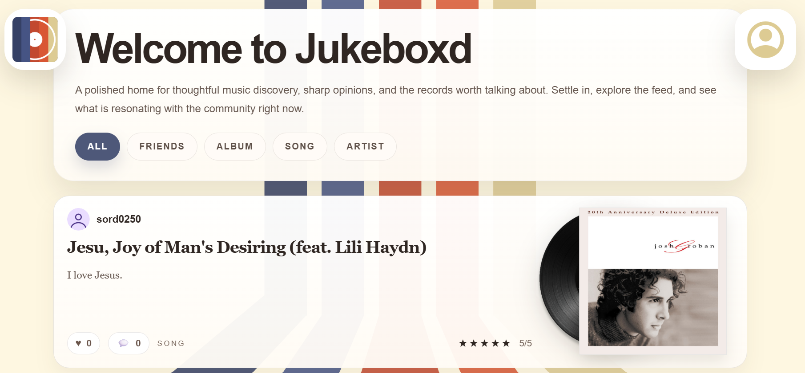
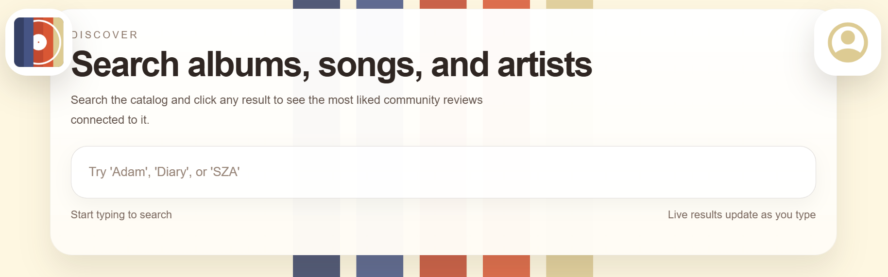
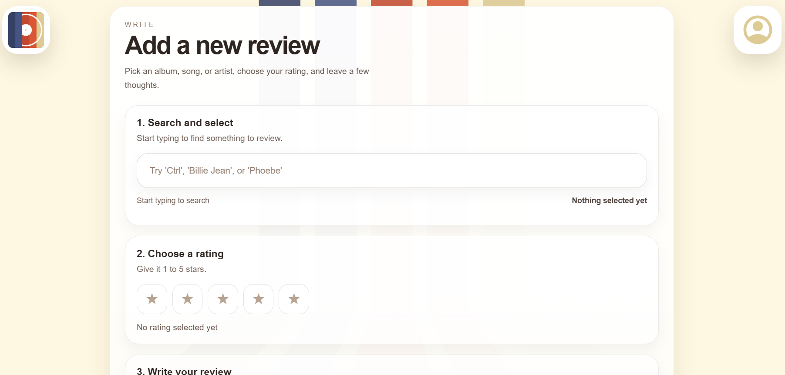
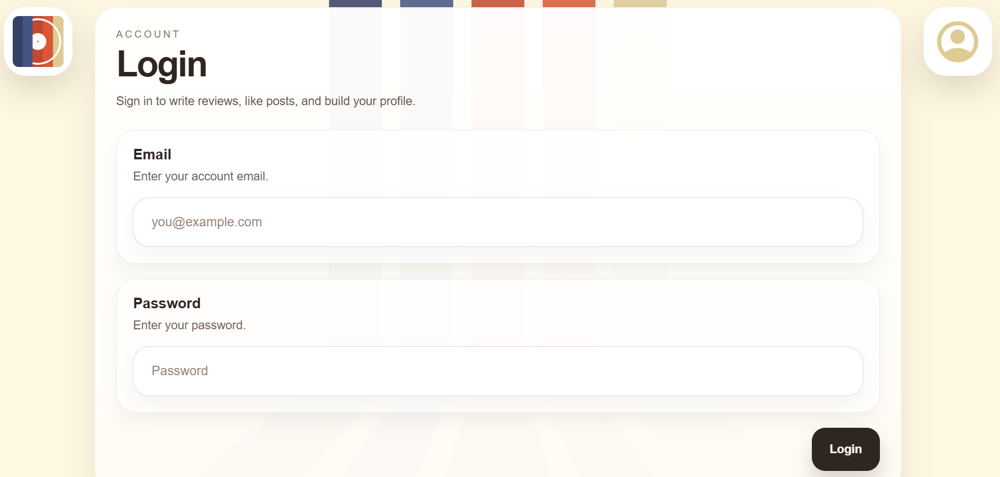
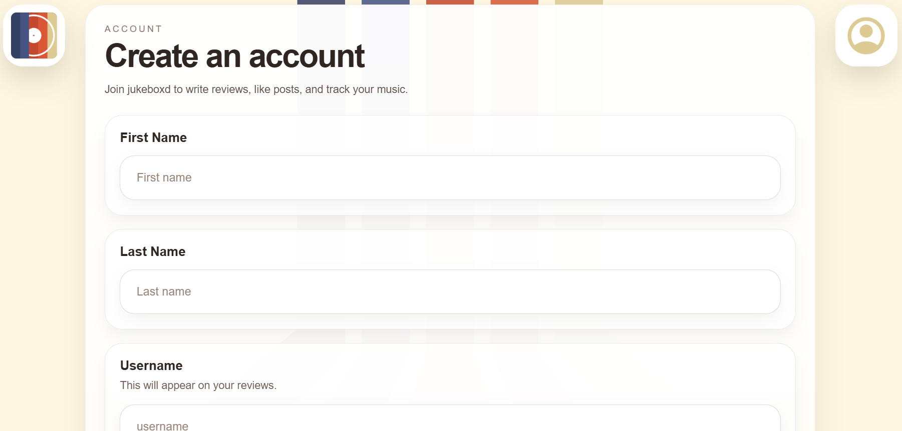
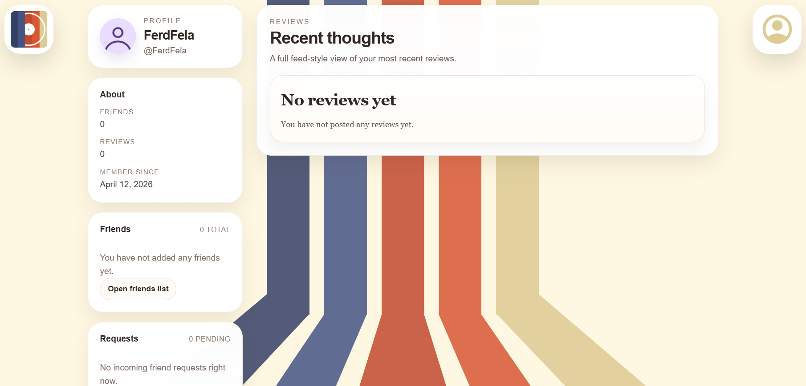

# JUKEBOXD: MUSIC REVIEWS

## IT&C 350 DATABASE DESIGN PROJECT
### WINTER 2026

* Spencer Ord
* Robert Stone
* James Sturdevant
* Ben Davis
* Brendan Lewis

---

## TABLE OF CONTENTS

* [PROJECT OBJECTIVE](#project-overview)
  * [PROJECT OBJECTIVE STATEMENT](#project-objective-statement)
  * [PROJECT STAKEHOLDERS](#project-stakeholders)
* [APP REQUIREMENTS](#app-requirements)
  * [FUNCTIONAL REQUIREMENTS](#functional-requirements)
  * [NON-FUNCTIONAL REQUIREMENTS](#non-functional-requirements)
* [DATABASE REQUIREMENTS](#database-requirements)
  * [ER DIAGRAM IMAGES](#er-diagram-images)
  * [SCHEMA DIAGRAM](#schema-diagram)
* [BUSINESS RULES](#business-rules)
  * [FIELD RULES](#field-rules)
  * [RELATIONAL RULES](#relational-rules)
  * [ROLE RULES](#role-rules)
  * [APPLICATION RULES](#application-rules)
* [DATABASE DOCUMENTATION](#database-documentation)
  * [GITHUB DOCUMENTATION](#github-documentation)
  * [NECESSARY DEPENDENCIES](#necessary-dependencies)
  * [CREATING THE DATABASE](#creating-the-database)
* [DATABASE VIEW DOCUMENTATION](#database-view-documentation)
* [API DOCUMENTATION](#api-documentation)
* [FRONT-END DOCUMENTATION](#front-end-documentation)
  * [/BACKEND](#backend)
  * [/TEMPLATES](#templates)
  * [/STATIC/JS](#static-js)
* [APPENDIX 1](#appendix-1-low-fidelity-paper-prototypes)
* [APPENDIX 2](#appendix-2-sql-scripts)
  * [CREATE STATEMENTS](#create-tables)
  * [INSERT STATEMENTS](#insert-statements)
  * [DELETE STATEMENTS](#delete-statements)
  * [DELETE EVERYTHING](#delete-everything)
* [APPENDIX 3](#appendix-3-sql-views)
  * [SEARCH VIEW](#search-view)
  * [ALBUM REVIEW VIEW](#album-review-view)
  * [ARTIST REVIEW VIEW](#artist-review-view)
  * [ALBUM REVIEW VIEW](#album-review-view)
  * [USER REVIEW VIEW](#user-review-view)


---

## PROJECT OVERVIEW

### PROJECT OBJECTIVE STATEMENT
Jukeboxd is a database that stores a user's reviews of musical albums and songs. Users will also be able to see other users' reviews.

### PROJECT STAKEHOLDERS
Stakeholders in Jukeboxd include music listeners and lovers, a professional team of coders, security professionals versed in database security, a marketing team, and a management team. Other stakeholders will eventually include singers, song-writers, record labels, and other musicians or staff working in the music industry. These are the primary stakeholders that would be affected by a music rating and sharing system like Jukeboxd. 

The following contains a breakdown of our stakeholders:
* Users
  * Serious music listeners
    * This group of people really cares about music. They may have a musical background or just really enjoy listening to it. 
    * They will most likely want to share thoughtful reviews with technical breakdown and their ratings will be thought-out. 
    * They will be interested in seeing similar reviews that they will engage with academically. 
    * This will probably represent the most engaged user base, but not make up the largest portion.
  * Casual music listeners
    * This group enjoys listening to music, but does not necessarily have a deep musical background. 
    * They will leave ratings, but probably only write short reviews, many of which will be humorous rather than critical. 
    * This group of people will probably make up the majority of the user base, but not be as engaged as serious listeners.
* Employees
  * A Professional Team of coders
    * There will need to be a development team that maintains the front-end and back-end of the application. 
    * They will be invested based on their employment.
  * Security professionals versed in database security
    * There will need to be a team that ensures the database is protected from attacks.
  * A marketing team
    * This team will promote the application and try to acquire sponsorships from artists, record labels, and music-sharing apps (like Spotify, Apple Music, etc.)
  * A management team
    * The management team will oversee the entire process. They will interface with the other shareholders to ensure their views are represented in the product.
* Potential Investors/Champions 
  * Singers
    * They will want to see their songs promoted on Jukeboxd. 
    * They can take feedback based on reviews, which could help them produce more popular songs.
  * Song-writers
    * Same as singers
  * Record labels
    * They will want to see artists signed to their label receiving good reviews. 
    * They could also promote their artists through the app which could generate more listenership and therefore more revenue. 
    * They could also identify artists they would like to sign based on who receives good reviews.
  * Others working in the music industry
    * Executives in the music industry would all benefit from more people listening to music and talking about popular albums and artists. 
    * If Jukeboxd is successful, it will generate more publicity and engagement with new songs and albums which will benefit everyone in the music industry, especially executives.

## APP REQUIREMENTS

### FUNCTIONAL REQUIREMENTS
* Users can look up and review songs and albums through a search bar
* Users can see the reviews other people have made and comment on them in a feed by searching
* Users can add friends by clicking on their profile that is displayed in their reviews
* Users will have a feed page that recommends their friend's reviews
* Users will be able to upload playlists for friends to see on their own page
* Users will be able to visit the page of other users to add them as friends, read their reviews, and see their playlists

### NON-FUNCTIONAL REQUIREMENTS
* The app should work on Android and iOS
* The UI should be clean and intuitive
* The database must support at least 1,000 concurrent users
* The database and app should be secure against basic attacks and vulnerabilities
* The app and database should be available 24/7
* Offline viewing should be available for selected albums, songs, or genres
* The database should be easy to scale, maintain and update
* The reviews should be out of 5 stars and have optional text
* Leaderboards for top rated songs and albums should be available for viewing

---

## DATABASE REQUIREMENTS

### ER DIAGRAM IMAGES
Jukeboxd Entity Relationship Diagram


---

## SCHEMA DIAGRAM
Jukeboxd Relational Schema Diagram


---

## BUSINESS RULES

### FIELD RULES
* Usernames must be at least 5 characters long and no longer than 12 characters
* The text field of a review cannot exceed 300 characters in length
* A review must have a star input (out of 5 stars, including 0)
* No duplicate usernames
* No duplicate emails

### RELATIONAL RULES
* An album must have at least 1 song
* An album must have at least 1 artist
* An artist must have at least 1 album
* An artist must have at least 1 song
* A review must have at least 1 album, artist, or song
* A review must have a star input (out of 5 stars, including 0)

### ROLE RULES
* Users cannot modify other users
* Users can make reviews
* Users can "like" any other user's reviews
* Users can edit their own reviews
* Users can delete their own reviews
* Users can delete their own account
* Admin users can delete other users
* Admin users can delete songs
* Admin users can delete reviews
* Admin users can delete artists
* Admin users can delete albums
* Admin users can create new genres
* Admin users can modify descriptive tags

### APPLICATION RULES
* Passwords cannot be a single dictionary word (putting password rules here because we do not store plaintext passwords in the database, so any logic will be in the application)
* Password must be 8 characters long and no longer than 16
* Password must contain a combination of Upper and Lowercase letters
* Password must have at least 1 non-alphabetical character
* Each review must have a timestamp

---

## DATABASE DOCUMENTATION

### GITHUB DOCUMENTATION
Jukeboxd is a public GitHub. To access the scripts that we have used to create our database, click [this link](https://github.com/sord0250/Jukeboxd-ITC350) and go to the 'Milestone 3' folder found under the 'Jukeboxd' folder. You will find the following scripts that contain SQL queries that configure the database, fill it with "dummy data," and empty the tables:

* 'Create Tables'
* 'DeleteAll'
* 'DeleteSome'
* 'Insert'

The scripts are also listed in Appendix 3 of this document.

As you can see in the screenshot below, each of the 5 team members can contribute to this repository.


### NECESSARY DEPENDENCIES
* **GITHUB** - our scripts and code live on the GitHub repository mentioned above.
* **VSCODE** - although not necessary, we use VSCode to connect to our repository. This allows us to edit scripts and work together on the project. If you don’t know how to clone the repository, follow [these instructions](https://code.visualstudio.com/docs/sourcecontrol/repos-remotes). 
* **MySQL Server** - allows for a locally hosted MySQL database to be created.
* **MySQL Workbench** - connects to the server and provides a graphical user interface (GUI) to run the queries that build the tables and populate them with dummy data. This application also allows users to see tables and their data.

### CREATING THE DATABASE
Listed below are the steps to create a locally hosted MySQL database instance of Jukeboxd. These instructions include setting up the MySQL Server and executing the queries.

1) Install [MySQL Server](https://dev.mysql.com/downloads/mysql/) and [MySQL Workbench](https://dev.mysql.com/downloads/workbench/) using default settings. Click on the hyperlinks to ensure you download the correct versions (you will want the most up-to-date version of both).
   a) Set a default password for the MySQL Server that you will remember.
2) In MySQL Workbench:
   a) Connect to local database instance (Local instance MySQL 96)
   b) Run the scripts found on our GitHub (by pasting the file contents and selecting the lightning button) in the following order:
      i) [CreateTables](https://github.com/sord0250/Jukeboxd-ITC350/blob/main/jukeboxd/Milestone%203/CreateTables) - this creates the database and the necessary tables
      ii) [Insert](https://github.com/sord0250/Jukeboxd-ITC350/blob/main/jukeboxd/Milestone%203/Insert) - this inserts dummy data into the tables
      iii) [DeleteSome](https://github.com/sord0250/Jukeboxd-ITC350/blob/main/jukeboxd/Milestone%203/DeleteSome) - this gives specific examples of how to delete dummy data from the tables. This represents the kind of queries that could be sent to the database by the frontend to delete specific reviews, songs, etc..
      iv) [DeleteAll](https://github.com/sord0250/Jukeboxd-ITC350/blob/main/jukeboxd/Milestone%203/DeleteAll) - this deletes all data from tables (note: this script uses 'ALTER TABLE <table_name> AUTO_INCREMENT = 1' so that dummy data can be inserted again after deletion).

To view the database structure at any time, go to the left-hand column. Switch from administration to schemas, and click the refresh button. The database and tables will be shown in that column.

---

## DATABASE VIEW DOCUMENTATION
We created six unique views for our database. Listed below are the unique views along with the purpose they serve.

* [**Search View**](https://github.com/sord0250/Jukeboxd-ITC350/blob/main/jukeboxd/Milestone%204/Search%20Review%20View) - combines the songs, albums, and artists into one view that will be used to implement the search bar functionality
  * i.e. a user will be able to click on the search bar and search for any song, album, or artist.

* [**Album Review View**](https://github.com/sord0250/Jukeboxd-ITC350/blob/main/jukeboxd/Milestone%204/Album%20Review%20View) - combines the album information and any reviews of albums, allowing a list of reviews of albums when a user selects an album.
  * i.e. a user will be able to select an album and see a list of all reviews of that particular album.

* [**Song Review View**](https://github.com/sord0250/Jukeboxd-ITC350/blob/main/jukeboxd/Milestone%204/Song%20Review%20View) - combines song information and reviews of any songs, along with artist name and album name, allowing for a list of song information and song reviews when a song is selected.
  * i.e. a user will be able to select a song and see its artist, the album it is in, and a list of all the reviews of that particular song.

* [**Artist Review View**](https://github.com/sord0250/Jukeboxd-ITC350/blob/main/jukeboxd/Milestone%204/Artist%20Review%20View) - combines artist information with reviews of said artists, which will be used to list reviews of any artists when a user selects an artist.
  * i.e. a user will be able to select a particular artist and see a list of all reviews of that artist.

* [**User’s Reviews**](https://github.com/sord0250/Jukeboxd-ITC350/blob/main/jukeboxd/Milestone%204/Users%20Reviews%20View) - combines user information with review information which will be used so a user can see a history of their reviews.
  * i.e. a user will be able to select their own profile or another user’s profile and see a list of all their reviews, regardless of review type.


To see the queries that are run to create the views, click on the hyperlinks above to access the Github or select [this link](https://github.com/sord0250/Jukeboxd-ITC350) and navigate to the milestone 4 folder. They are also stored in Appendix 4 of this document.

## API DOCUMENTATION

Our database is being hosted on a Digital Ocean Droplet that our entire team had access to. To make our database available online, we downloaded Directus, a headless content management system. This CMS automatically wraps our database and generates a RESTful API, so we didn't need to create the REST API ourselves. This led to other issues, but we were able to successfully overcome all of them and create a working API for our jukeboxd database. 

### DIRECTUS ROUTES 

#### /items/ARTIST

#### /items/ALBUM

#### /items/USER

#### /items/SONG

#### /items/REVIEW

#### /search?q=

#### /artist_review/

#### /album_reviews/

#### /song_review/

#### /user_review/


### DIRECTUS PROBLEMS

One issue we had with Directus was creating our views. Since Directus created the API for use, we could not configure it to connect to our database views, or even see them. It took some work, but for each view that we wanted in our database, we needed to create a `.js` extension file that did ended up doing the same thing as creating a view, but with a lot more steps.  


Here is an example of a Directus view extension. 


## FRONT-END DOCUMENTATION

Our web application is incredibly complex and runs many files to properly. Below are detailed descriptions of each file necessary for our frontend.

### `jukeboxd/FrontEnd` (parent directory)

- `jukeboxd/FrontEnd/app.py`  
  Our frontend is running through a python flask container. `app.py` creates the core functionality of our frontend. It establishes the API routes for the rest of the functions. This file serves as the bridge between the database and the python files we created for the rest of the frontend to work. The only dependency we used for this file was `python.flask`. This file pulls the global variables used throughout the program from `config.py`. The only function this file uses is `{"client_config": {"DIRECTUS_URL": DIRECTUS_URL}}`, which injects the DIRECTUS_URL into all `.py` functions used in the program. 

### /BACKEND/ROUTES

This section of the code deals with the Directus connections. It establishes routes to and from the database, and allows for a smooth transition of information between the database and frontend. Almost all of the files in this section are dependent on one or more files in `/backend/helpers`.

#### `jukeboxd/FrontEnd/backend`

- `jukeboxd/FrontEnd/backend/config.py`  
  This file pulls all secret values and environment variables from `.env`. It also defines the Directus base URL, and stores size limits for `input_sanitization.py`. This file is dependent on `os` to load the `.env` variables, and `pathlib.Path` to resolve the file paths used in the web program. This file creates no UI or session state, but it does set environmental state based on information in the `.env` file.

#### `jukeboxd/FrontEnd/backend/routes`

- `jukeboxd/FrontEnd/backend/routes/pages.py`  
  This file is used to generate the HTML pages for the frontend. These URL endpoints are all accessable to a typical user: `/`, `/search`, `/profile`, `/profile/<username>`, `/add`, `/login`, `/register`, and `/stats`. This file is dependent on `python.flask` and `backend.helpers.input_sanitization`. This page is statless as its purpose is to render the pages. This file uses the `render_template()` function to render the pages, and `profile_by_username()` to generate a specialized user profile page for each user. 

- `jukeboxd/FrontEnd/backend/routes/auth.py`  
  This file creates the login, registration, and logout functions and establishes their connection with the server. It creates a connection with the Directus API, and sets session state `session["user_id"]` and `session["username"]` with the `login` function. It clears the session state in the `logout` function. The register `function` updates the database with a new user. This file has dependencies on `datetime`, `bcrypt`, `requests`, and `flask`. 

  - `/logout`

    This endpoint clears the current user's session data and redirects them to the root URL. It uses a GET method to call `session.clear()`. The user is automatically logged out because their user_id and username that are being stored in the Flask session are deleted. This doesn't interact with Directus at all. 

  - `/api/register`   

    This endpoint uses a POST method to register a new user in the database. This endpoint uses the parameters firstName, lastName, username, email, and password to create the new user. This route first sends the input parameters through `input_sanitization.py`. If an input does not pass an `input_sanitization.py`, it is set as NULL, and the user is prompted to insert a valid input instead. Then, all passwords are hashed with `bcrypt.hashpw`. Then, a POST is sent to the Directus endpoint `/items/USER` with the user's information. 

  - `/api/login`

    This endpoint checks if a user exists in the database. It also sends the user inputs to `input_sanitization.py`, and subsequently passes the password through a hash function before sending them to `/items/USER` in Directus with a GET request. If the password hash doesn't match with the one stored in the database, the login fails, and if the username does not exist in the database, then the login also fails. If the passwords match, then `session["user_id"]` and `session["username"]` are set from the U_ID and U_Username pulled from the database. 

- `jukeboxd/FrontEnd/backend/routes/data.py`  
  This file connects to the Directus API endpoints, and sets a route for the rest of the application to connect to the basic Directus endpoints. This file has dependencies on `python.requests` and `jsonify`. This file is stateless and creates a function for each API endpoint. For example, `get_users()` retrieves the Directus endpoint `/items/USER` for use by the frontend. 

- `jukeboxd/FrontEnd/backend/routes/profile.py`  
  This file creates the backend logic for the user profile page. This file uses both GET and PATCH methods to pull from and update the database. This file checks for session state set with `user_id` and `username` if there is no path set. When this page is generated from session data, it also give the user the ability to edit their profile. When a user attempts to update their profile information, this file validates names, prevents email/username changes, and updates Directus. Alternatively, if there is a set username in the URL path, it will display the requested users profile page and the reviews that they have made. This file is dependent on `python.flask` and `python.requests`. This file can update the session state by changing the username. This file mainly consists of a single function (`register_profile_routes()`), which GETs user profile pages, and PATCHES them when the edit profile button is pressed. 


- `jukeboxd/FrontEnd/backend/routes/reviews.py`  
  This file imports many functions from the `backend/helpers` section of the code and is the most complicated route module. It accomplishes several important sections of the frontend: the review feed, related review search, likes, comments, user review lists, and review creation. This creates a list of items to search through, so each song, artist, and album is an item that can be searched for and displayed in the feed. 
  This file has dependencies on `python.flask`, and `python.requests`. This file reads from the session state, and POSTs to Directus updated comments, likes, and reviews. 

  - `/feed` 

    This endpoint grabs the `feed_review` from Directus. This connects to a `feed` function that pulls reference data for songs, albums, and artists, normalizes them, then attatches review comments to songs in the feed. 

  - `/search_related_reviews`

    This endpoint pulls all reviews from Directus and filters them by `item_type` and `item_id`, which were defined in the search view extension in Directus. This also sorts the items in the feed by likes and date, and running them through a function that creates a key for each review, then sorts each item by its respective key. 

  - `/api/reviews/<id>/like`

    This endpoint tracks the likes of a specific comment, chosen by the `<id>` in the URL endpoint. This endpoint fetches the number of likes, and can change the number of likes by adding a new one or deleting one. This is done by read-modify-write (fetches current count and either adds or subtracts one based on HTTP method), and doesn't track likes by a specific user. This can cause race conditions, but we didn't feel the need to created a more complicated solution. 

  - `/api/reviews/<id>/comments` 

    This endpoint returns all comments for a specific review, again chosen by the `<id>` in the URL endpoint. This endpoint accepts GET methods to show a review's comments, and it accepts POST to create a new comment. When the method is POST, the user login in confirmed, the review is also verified to exist, the comment text is sanitized and pushed to the server. Then the content summary is returned to the user's browser. 

  - `/api/user_reviews/<username>`

    This endpoint returns the Directus `user_review` view and filters it based on `username`. Then comments and likes for each review are attached. All reviews by the specified user are displayed, and if there is no `<username>` in the URL, then the user specified by the session state is displayed instead. 

  - `/add_review` 

    This endpoint verifies that the user's session state is set correctly, and lets a signed in user create a review. When the review is submitted, `input_sanitization.py` is called to sanitize user inputs. If the input passes `input_sanitization.py`, it is POSTed to Directus to then be displayed in the feed and in the associated user's `user_review` list. 


- `jukeboxd/FrontEnd/backend/routes/friendships.py`  
  This file creates the friendship functionality. It allows users to view theri friend list, send freind requests, and accept or delete requests. API routes for loading friendship state, sending requests, accepting requests, canceling or declining requests, and removing friends. This file uses the session state to verify that the user is logged in, and sends POSTs, PATCHes, and DELETEs to directus to update friendship statuses. This code has dependencies on `datetime`, `requests`, and `flask`. It changes friendship status state, so the UI state is actively modified based on sent, accepted, and rejected friend requests. 

  - `/api/friendships` (GET)  

    This endpoint takes a username, either from a query or a interactive button, and returns that 
    user's friend list, and the current friendship relationship between the viewer and the 
    viewed user. If the user being viewed is the active user in the session state, then their incoming friend requests are also displayed. Friend lists are sorted alphabetically, incoming requests are sorted by the most recently sent.

  - `/api/friendships` (POST)  

    This endpoint actually sends a friend request to a specific user by username in URL query. If a friendship already exists, then it returns a conflict message. If no friendship exists, it POSTs a new `FRIENDSHIP` record to Directus with status `pending` and the logged in user as the requester.

  - `/api/friendships/<id>` (PATCH/DELETE)  

    This endpoint deals with a sent friend request. Directus validates if the friendship exists, and if the request is still pending. The DELETE method can remove existing freidnships as well as reject incoming requests. Then, depending on user interaction with the webpage, it either a PATCH or DELETE HTTP request are sent to Directus. It a PATCH was sent, Directus with status `accepted` and a timestamp, and if a DELETE was sent, it returns "Friend removed", "Friend request canceled", or "Friend request declined" depending on the prior state of the 
    friendship. 


### /BACKEND/HELPERS

This section of the code contains essential functions for the server to run. It contains the logic for how the information retreived from the database is modified and dealt with. 

#### `jukeboxd/FrontEnd/backend/helpers`

- `jukeboxd/FrontEnd/backend/helpers/common.py`  
  This file holds a collection of small, stateless helper functions. These functions are commonly used accross the `/route` files. This file contains no routes, no session interaction, and it creates no state. The common functions extract Directus payloads, filter user reviews, normalize item types, and display API error messages. This file's only dependency is `DIRECTUS_URL` from `backend.config`. 

  - `_extract_payload_list()`  

    This function normalizes a Directus response as a list. It returns the list and a container key so the original response can be reconstructed if needed.

  - `_filter_user_reviews()`  

    This function filters a review based on a given username or user ID. This function also keeps the original payload shape on return.

  - `_extract_api_error()`  

    This function deals with Directus error messages. It returns Directus error messages in a human readable format error based on where the errors are located (`message`, `detail`, `error`, `errors`, `extensions`). It returns the first error found, or `default_message` if none can be extracted.

  - `_coerce_like_count()`  

    This function converts the like count to an integer. It returns 0 on failure or null input.

  - `_normalize_search_item_type()`  

    This function normalizes a search string to either `"song"`, `"album"`, or `"artist"`. It makes the input lowercase and prefix-matches. It also returns the lowercased value unchanged if no match is found.

  - `_resolve_media_url()`  

    This function normalizes media URLs. This function skips absolute URLs, and attaches `DIRECTUS_URL` to root-relative paths. 
    

- `jukeboxd/FrontEnd/backend/helpers/comments.py`  
  This file fetches, creates, and summarizes comments. It pulls comments from Directus based on a review ID or a username. This file has dependencies on `datetime` and `requests`, as well as our own `backend.config`, `helpers.common`, and `helpers.input_sanitization` files. This file creates no session state, and it doesn't directly affect the UI, but it does all of the backend work for comments used in the `backend.routes` folder. 


  - `_fetch_comment_items()`  
    This fucntion pulls comments from Directus, and then normalizes each row into a consistent 
    shape. This function also filters out empty comments and reports a `RuntimeError` instead of returning an empty list.

  - `_get_review_comments()`  
    This function returns the comment list of a specific review and sorts them 
    with the newest comments first.

  - `_add_review_comment()`  
    This function creates a new comment on a review. It first sanitizes the comment text and username, then POSTs a new comment record to Directus with a server-generated timestamp. After the POST, Directus returns the normalized comment to this function, but sends a `RuntimeError` if the POST fails.

  - `_get_comment_summary_map()`  
    This function takes a list of review IDs and returns a dictionary. In the returned dictionary, each key is a review ID and each value contains a comment count and a  list of the most recent comments up to a set `preview_limit`. This function fetches all comments at once and distributes them between their respective reviews.

  - `_attach_comment_summaries()`  
    This function connects the `comment_count` and `comments_preview` fields to each review. It normalizes the comment summaries, and preserves the original payload shape when it returns to Directus. This is also the main function called by the route files.


- `jukeboxd/FrontEnd/backend/helpers/friendships.py`  
  This file reads friendship rows, normalizes friend data, orders friendship pairs, and looks up users in friendships. This file is dependent on `python.requests`, our `backend.config`, and our `helpers.common` files. This file doesn't create routes or session state, and is a backend specific file used by `backend.routes` to smoothly integrate with all friendship information with the frontend. This function is also responsible for defining the variables `FRIENDSHIP_FIELDS` and `FRIENDSHIP_USER_FIELDS`. 

   - `_normalize_friendship_pair()`  
    This function sorts two user IDs into a low to high order. This verifies that any friendship 
    between users A and B is  stored and looked up the same way independently of the user who initiated it.

  - `_normalize_friendship_record()`  
    This function converts a raw Directus friendship result into a dictionary with coerced int IDs and a status string.

  - `_serialize_friend_user()`  
    This function converts a raw Directus user result into a dictionary with only relevant friendship display fields.

  - `_fetch_all_friendships()`  
    This function fetches up to 1000 friendship records from Directus, normalizes them, and 
    filters out all freindships with a null `F_ID`.

  - `_fetch_friendship_by_id()`  
    This function fetches a single friendship by ID.

  - `_fetch_friend_user_lookup()`  
    This function fetches up to 1000 user records from Directus and returns them as a 
    dictionary. This dic uses `U_ID` as the key and the dic is used to resolve user details from a friendship record without needing to make a new request for every user.

  - `_friendship_involves_user()`  
    This function returns `True` if the given user ID is in a friendship record.

  - `_get_other_friendship_user_id()`  
    This function shows the other user ID in a friendship record when `_friendship_involves_user()` shows a user does indeed have a friendship. These two functions are usually used together.

  - `_find_friendship_between()`  
    This function searches for if a friendship exists between users A and B.

- `jukeboxd/FrontEnd/backend/helpers/input_sanitization.py`  
  This file sanitizes names, usernames, emails, passwords, comments, reviews, ratings, and review payload construction. It depends on `html`, `re`, `datetime`, and `backend.config`. It has no routes and creates no session or UI state. This function does define the `_USERNAME_PATTERN`, `_EMAIL_PATTERN`, and `_INLINE_WHITESPACE_PATTERN` regex patterns. This function first creates a class that checks for style and script tags. 

  - `_strip_html_markup()`  
    This function identifies HTML script and style tags and removes them.

  - `_strip_control_characters()`  
    This function removes control characters and non-printable characters from inputs.

  - `_normalize_text_whitespace()`  
    This function reduces inputted whitespace to a single newline.

  - `_sanitize_plain_text()`  
    The 3 above functions are run simultaneously and also sets a limit of `max_length` characters. This funcition is used in several subsequent functions to sanitize new usernames, existing usernames, emails, passwords, comments, and review text/ratings.

  - `_sanitize_positive_int()`  
    This function forces inputs to positive ints, and it is generally used to validate IDs.

  - `_build_sanitized_review_payload()`  
    This function is one of the more complex ones. It sanitizes all input fields and validates that only one `S_ID`, `AL_ID`, or `ART_ID` is provided. It then returns a review payload to POST to Directus. This function also appends a date to the reviews for sorting. 

- `jukeboxd/FrontEnd/backend/helpers/payloads.py`  
  This file holds several wrapper functions for fetching the Directus payload bundles and view extensions needed for feed, search, and profile review normalization. It is only dependent on `requests` and `backend.config`. It has no routes, no state, and no logic other than HTTP requests and returning raw JSON. 

  - `_fetch_review_reference_payloads()`  
    This function fetches all six database tables needed to build a complete review(`REVIEW`, `SONG`, `ALBUM`, `ARTIST`, `MAKES_SONG`, and `MAKES_ALBUM`). It then returns their raw JSON responses as a tuple.

  - `_fetch_search_reference_payloads()`  
    This function fetches `SONG`, `ALBUM`, `ARTIST`, `MAKES_SONG`, and `MAKES_ALBUM`. It reduces the size of `SONG` and `ALBUM` to make searches more suited for display. It returns a five-item tuple that contains results of a search. 

  - `_fetch_review_view_payloads()`  
    This function fetches our Directus views (`song_review`, `album_reviews`, and `artist_review`) and returns their raw JSON responses as a tuple. 

- `jukeboxd/FrontEnd/backend/helpers/profile.py`  
  This function holds profile helper functions for looking users up by username, serializing user objects, and translating Directus profile-update errors into friendlier messages. It has 
  no routes and creates no session or UI state. It depends on `requests` and `helpers.common`. 

    - `_serialize_profile_user()`  
    This function converts a Directus user record into a dictionary containing only the fields relevant to profile display and editing (`U_ID`, `U_FName`, `U_LName`, `U_Username`, `U_Email`, and `U_DateCreated`). 

  - `_get_user_by_username()`  
    This function connects to Directus and pulls a single user based on a given username. Directus returns the raw record and raises a `RuntimeError` on a failed request. 

  - `_profile_update_error_message()`  
    This function translates `_extract_api_error` for easier readability. It detects permission errors, duplicate username conflicts, and duplicate email conflicts in the Directus response and returns an easily readable message for each. 

  - `_is_user_field_taken()`  
    This function is used to detect duplicate username or email before attempting an update.It works by querying Directus for any user with a matching value for a given field, and then checks whether that user is someone other than the current user. 

- `jukeboxd/FrontEnd/backend/helpers/review_normalization.py`  
  This file merges raw Directus review data with song, album, artist, and relationship tables so the frontend gets consistent feed/search/profile review objects. This file is dependent on several `helpers.common` functions. 

  This file is very large as it solves some problems we had in creating and storing reviews. Directus stores reviews, songs, albums, artists, and made-by tables separately. This file joins them and resolves artist names, items they have made, and review type for every review before returning a single normalized list.

    - `_build_artist_name_maps()`  
    This function is the lookup builder. It uses `MAKES_SONG` and `MAKES_ALBUM` to build two dictionaries. They map song IDs and album IDs to their respective artists. Songs with no connected artist in `MAKES_SONG` use their album's artist to prevent errors. These dics are built once and reused across all normalization functions. 

  - `_resolve_artist_names()`  
    This function returns the artist name for a single review by trying song, then album, then direct artist ID in order, and returning the first match found. 

  - `_build_review_enrichment()`  
    This function builds a dictionary using `review_ID` as the key. This function then pulls the following display fields for each review: `num_likes`, `artwork_url`, `artwork_alt`, and `artist_names`. Used by `_normalize_feed_payload` to avoid repeating the same lookups per row.

  - `_normalize_feed_payload()`  
    This function normalizes the `feed_review` Directus view. It enriches each row with artwork and artist names that are resolved from the reference tables. Rows with no matching `review_ID` receive null artwork and artist fields instead of being dropped. 

  - `_normalize_search_results()`  
    This function normalizes search results by resolving each item's type, title, artwork, other details like artist name for songs and albums or genre for artists. It handles songs, albums, and artists in separate branches. 

  - `_build_review_view_maps()`  
    This function indexes the Directus views `song_review`, `album_reviews`, and`artist_review` by review ID so they can be used if the main `REVIEW` table contains missing fields.

  - `_normalize_user_profile_reviews()`  
    This function is the most complex in the file. It normalizes a user's specific review list by joining on all reference tables and the three review views. It determines the `review_type` by checking if `S_ID`, `AL_ID`, or `ART_ID` is set, then resolves the title, album name, artist name, and artwork accordingly. It returns normalized rows that are sorted with the newest first.

  - `_normalize_review_records()`  
    This function normalizes reviews for feed, song, album, and artist review endpoints. It joins reviews against songs, albums, and artists, resolves all display fields, and returns a normalized list sorted with the newest first. 

  - `_filter_normalized_reviews()`  
    This function filters a prenormalized review list into a single `review_type`. It keeps the original payload shape on return. 

### /TEMPLATES

#### `jukeboxd/FrontEnd/templates`

This folder holds the html, js, and css files that form the skeleton of our frontend. All of the html files in this directory render the `navbar` and `scripts` from our `/templates/components` folder. All of the templates also use `Jinja2` to interface with our `flask` container.

- `jukeboxd/FrontEnd/templates/index.html`  
  This file renders the home page of the website.  The home page is also where the feed is displayed. It renders the welcome section, feed filter buttons, feed list, and back-to-top button. This page GETs from the api endpoint `/api/feed`.



- `jukeboxd/FrontEnd/templates/search.html`  
  This file renders the search page. It renders the live search UI and the modal that shows top related reviews for a selected item. This page GETs from the api endpoint `/api/search`.



- `jukeboxd/FrontEnd/templates/add.html`  
  Ths file renders the page that creates new reviews. It contains the search picker, star rating controls, review text area, form message, and review toast. This page GETs from the api endpoint `/api/search` and POSTs to `/api/add_review` with the JSON `{R_Text, R_Rating, S_ID/AL_ID/ART_ID}`. It POSTs the results of a form to this endoint. The form uses `novalidate` as our app uses `input_sanitization.py` for validation. 



- `jukeboxd/FrontEnd/templates/login.html`  
  This file generates the login form page for email and password sign-in. This page POSTs to `/api/login` using `{email, password}`. It POSTs the results of a form to this endoint. This form also uses `novalidate` in the html body. 



- `jukeboxd/FrontEnd/templates/register.html`  
  This file renders the registration form page. It is very similar to `login.html`, except the form contains first name, last name, username, email, and password. This page POSTs to `/api/register` using `{firstName, lastName, username, email, password}`.



- `jukeboxd/FrontEnd/templates/profile.html`  
  This file renders the profile page layout. It shows profile summary info, friends, incoming requests, account actions, and the user’s review list. This page renders differently depending on whether the viewer owns the profile, which is determined by `flask` and injected into the page as a `data-is-own-profile` attribute on the `<body>` tag. This html page actually receives values from the flask container and integrates them in the page with `Jinja2`. This file also connects to several API endpoints. It GETs from `/api/friendships?username=`, `/api/reviews/<id>/comments`, `/api/user_reviews/<username>`, and `/api/profile?username=` ; POSTs to `/api/friendships`, `/api/reviews/<id>/comments` with `{ "commentText": "comment content" }`, and `/api/reviews/<id>/like`; PATCHes to `/api/friendships/<id>` with `{ "action": "accept" }` and `/api/profile` with `{firstName, lastName, username}`; and DELETEs from `/api/friendships/<id>`.



- `jukeboxd/FrontEnd/templates/stats.html`  
  This file renders a placeholder page for future stats or messages work. Right now it only renders a very minimal page shell. This portion of our website is out of scope for our class.


#### `jukeboxd/FrontEnd/templates/components`

- `jukeboxd/FrontEnd/templates/components/navbar.html`  
  This file generates the shared top navigation bar used across all pages of the site. The navbar includes the home logo, search/add links, and profile/account area. It the user is logged in, it uses `session.get('user_id')` to render the search and add review buttons. 

- `jukeboxd/FrontEnd/templates/components/scripts.html`  
  This file is a shared script include file that loads the app’s core JavaScript modules in order. `core.js`is loaded first, everything else depends on this. `api.js` is loaded second for all fetch functions used by page scripts. `reviews.js` is third and shares review rendering, which needs to be loaded before any page script that renders reviews. Then all page scripts (search.js, feed.js, profile_friendships.js, profile.js, add.js, auth.js) are loaded because they can now interact with their dependencies. `navbar.js` is then loaded since it depends on auth state. `boot.js` is the last to be loaded, as it is the initializer that reads the current page and calls the appropriate init function. This file receives global variables for the templates from `client_config`.  

- `jukeboxd/FrontEnd/templates/components/profile_edit_modal.html`  
  This file creates a template for the edit-profile modal. This locks username/email fields and only allows edits to first/last name fields. This file PATCHes to `/api/profile` with `{"firstName", "lastName", "username"}`, even though username cannot be changed. 

- `jukeboxd/FrontEnd/templates/components/profile_friends_modal.html`  
  This file creates a template to display a full friends list modal on the profile page. This file only serves to display results of `refreshFriendshipData()`. 


### /STATIC/JS

#### `jukeboxd/FrontEnd/static/js/app`

- `jukeboxd/FrontEnd/static/js/app/boot.js`  
  This file is the app bootstrapper. It calls all page initialization functions after `DOMContentLoaded`.

- `jukeboxd/FrontEnd/static/js/app/core.js`  
  This file is creates a shared utility layer for checking login state, reading/writing localStorage identity, and logging out. 

  - `isLoggedIn()`
    This function verifies logins. It only checks if the `user_id` exists in the session state.

  - `requireLogin()`
    This function redirects all users to `/login` if `user_id` does not exist in the session state. 

  - `logoutUser()` 
    This function clears the session state from the browser. It clears `user_id`, `username`, and `user_email`. 

- `jukeboxd/FrontEnd/static/js/app/api.js`  
  This file creates a shared frontend API wrapper for search, feed, reviews, comments, profiles, friendships, and likes. Every HTTP call in the app uses a function defined here to connect to our API. 

  - `fetchSearch()`
    This function runs a GET call to `/api/search?q=` 

  - `fetchSearchRelatedReviews()`
    This function runs a GET call to `/api/search_related_reviews?type=&id=&limit=`.

  - `fetchFeedReviews()`
    This function runs a GET call to `/api/feed`.

  - `fetchUserReviews()`
    This function runs a GET call to `/api/user_reviews?username=`.

  - `fetchProfile()`
    This function runs a GET call to `/api/profile?username=`.

  - `fetchCurrentProfile()`
    This function runs a GET call to `/api/profile`.

  - `updateCurrentProfile()`
    This function runs a PATCH call to `/api/profile` with the JSON body `{firstName, lastName, username}`.

  - `createReview()`
    This function runs a POST call to `/api/add_review` with the JSON body `{R_Text, R_Rating, S_ID or AL_ID or ART_ID}`.

  - `fetchReviewComments()`
    This function runs a GET call to `/api/reviews/<id>/comments`.

  - `createReviewComment()`
    This function runs a POST call to `/api/reviews/<id>/comments` with a JSON body of `{commentText}`.

  - `setReviewLike()`
    This function runs both POST and DELETE calls to `/api/reviews/<id>/like`.

  - `fetchFriendshipData()`
    This function runs a GET call to `/api/friendships?username=`.

  - `createFriendRequest()`
    This function runs a POST call to `/api/friendships` with a JSON body of `{username}`.

  - `updateFriendship()`  
    This function runs a PATCH call to `/api/friendships/<id>` with the JSON body `{action}`. The action is always `"accept"`. 

  - `deleteFriendship()`  
    This function runs a DELETE call to `/api/friendships/<id>`.


- `jukeboxd/FrontEnd/static/js/app/navbar.js`  
  This function creates the navbar behavior module. It fills the account dropdown with login/register or logout actions depending on local login state. 

  - `initNavbarAccount()`
    This function fills the `nav-account-dropdown` based on the session state in `localStorage`. If `user_id` exists, it renders the logout button. If not, it renders the `login` and `register` buttons. The logout button in the navbar is rendered as an `<a href="/login">`, but it calls `logoutUser()` instead of navigating to `/login`.

- `jukeboxd/FrontEnd/static/js/app/reviews.js`  
  This file generates the shared review UI engine. It normalizes review objects, builds feed cards, supports likes, opens the comment modal, formats ratings, and generates profile links from usernames. 

  - `createReviewCommentsModalState()`  
    This function creates a default modal state object with all fields set as NULL. It also accepts overrides to set specific fields.

  - `isReviewCommentsModalOpenFor()`  
    This function returns true if the comments modal is open and contains a specific `reviewId`.

  - `syncReviewCommentState()`  
    This function updates comment data in both `allFeedReviews` and the page review list every time a comment is posted. It then rerenders the page after syncing the user and database feeds.  

  - `getLikedReviewStorageKey()`  
    This function returns the `liked_reviews:<username>` stored in `localStorage` and returns `NULL` if no user is logged in.

  - `getLikedReviewIds()`  
    This function reads and parses the user's liked reviewId list from `localStorage`. 

  - `hasLikedReview()`  
    This function returns true if the user has liked a specified reviewId.

  - `storeLikedReview()`  
    This function appends a reviewId to the user's `likedReviewIds` list in `localStorage`.

  - `removeLikedReview()`  
    This function removes a reviewId from the user's `likedReviewIds` list in `localStorage`.

  - `updateFeedReviewLikeCount()`  
    This function updates the like count for a specific review in `allFeedReviews`.

  - `updateReviewLikeCountInList()`  
    This function updates the like count for a review in the page review list. It creates a new review list with an updated like count for a specific review. This function increases the like count of `num_likes`, `review_num_likes`, and `R_NumOfLikes`, updates the page review list and returns it.

  - `updateFeedReviewComments()`  
    This function updates the comment preview and count for a specific review in `allFeedReviews` 
    in place. It also returns a review list with `{num_likes, review_num_likes, R_NumOfLikes}`.

  - `updateReviewCommentsInList()`  
    This function returns a new review list with comment data updated for a specific review. 
    It is used to update page review lists without directly changing them.

  - `escapeHtml()`  
    This function escapes HTML special characters in a string to stop XSS and returns the escaped string. 

  - `normalizeReviewComment()`  
    This function converts a comment record into a normalized form, whether it came from Directus or the user input form. 

  - `getReviewCommentsPreview()`  
    This function pulls the comments preview array from a review and normalizes it. It removes entries with empty text.

  - `getReviewCommentCount()`  
    This function extracts the comment count from a review and returns it.

  - `formatReviewCommentTimestamp()`  
    This function normalizes a timestamp string into a month, day, year format. It returns an empty string for missing values.

  - `createReviewCommentMarkup()`  
    This function transforms a comment into an HTML string and returns it. It can include a formatted timestamp.

  - `ensureReviewCommentsModal()`  
    This function verifies that the review comments modal exists, and if not, then it creates a DOM obj for the comments modal and attatches it to the HTML page `<body>`. It creates event handlers (close button, backdrop click, esc key, and form submit) and stores the newly created modal in `reviewCommentsModalElements`. The new modal is then returned.

  - `closeReviewCommentsModal()`  
    This function removes the comments modal, clears active state, increments the modal request ID, and rerenders the review list. 

  - `renderReviewCommentsModal()`  
    This function generates HTML for the comments modal from the current modal state. It generates the comment form, comment list, loading state, and error state.

  - `openReviewCommentsModal()`  
    This function opens the comments modal for a specific review. It starts with a loading state, then FETCHes comments from `/api/reviews/<id>/comments` and rerenders the page. This function uses the reviewId to throw out stale responses if the modal is opened for a different review before the FETCH is finished. 

  - `getReviewLikeCount()`  
    This function extracts the like count from a review.

  - `normalizeFeedReview()`  
    This function returns `num_likes`, `comment_count`, and `comments_preview` for an entry in the feed.

  - `createProfileHref()`  
    This function returns the profile URL for a specific username. It uses `/profile` for the current user and `/profile/<username>` for others. 

  - `getReviewArtwork()`  
    This function returns a JSON `{src, alt}` object for a review artwork. It also creates a fallback record for artists and a default album cover image for song and album reviews.

  - `bindReviewLikeHandler()`  
    This function creates a like/unlike click handler for the review list container. This is used to recieve  like and unlike actions from the user. It updates `localStorage`, `allFeedReviews`, and the page review list and rerenders the page.  

  - `bindReviewCommentHandler()`  
    This function creates a comment click handler for the review list container. This function opens the comments modal when a comment button is clicked.

  - `formatFeedRatingDisplay()`  
    This function converts a numeric rating into a string with star images. This function returns both the star images and a score out of 5 for each review in the feed. 

  - `formatAverageRatingDisplay()`  
    This function is very similar to `formatFeedRatingDisplay()`. It converts a numeric rating into a string with star images and returns both the star images and a score out of 5 for each review in the feed. The biggest difference is that the score out of 5 allows a decimal place. 

  - `createFeedCard()`  
    This function creates and renders a review card as an HTML string. This function is used by every page that displays reviews (feed, profile, and search details). It also resolves the artwork, formats review ratings, generates profile links, and sets a like state from `localStorage`.

  - `formatMemberSince()`  
    This function normalizes a date string into a long date format and returns it parsed. 

  - `renderProfileSummary()`  
    This function populates `#profile-name`, `#profile-handle`, and `#profile-member` with the given profile obj.

#### `jukeboxd/FrontEnd/static/js/app/pages`

- `jukeboxd/FrontEnd/static/js/app/pages/auth.js`  
  This function integrates login and registration with the flask logic. It POSTs to `/api/login` and `/api/register`, stores auth state in `localStorage`, and starts the login and register form handlers.

  - `registerUser()`  
    This function POSTs a JSON obj with `{firstName, lastName, username, email, password}` to the `/api/register` endpoint and returns a `{success, message}` obj.

  - `initRegisterPage()`  
    This function pulls the register form from `register.html`. It verifies that all fields are filled and that the username is 5-12 characters. It then calls `registerUser()`. If successful, it calls `loginUser()` and redirects to `/`.

  - `loginUser()`  
    This function POSTs JSON obj `{email, password}` to `/api/login`. Then it stores `user_id`, `username`, and `user_email` in `localStorage` and returns true, and it stores nothing and returns false if the login fails.

  - `initLoginPage()`  
    This function pulls the login form from `login.html`. It verifies that both fields are filled and calls `loginUser()`subsequently redirecting to `/`.


- `jukeboxd/FrontEnd/static/js/app/pages/feed.js`  
  This file creates and controls the feed home page. It loads the feed, handles infinite scrolling and the back-to-top button, supports the all/friends/song/album/artist filters, and renders empty-state messages.

  - `initHomeFeed()`  
    This function what starts the feed page. It FETCHes reviews from our `/api/feed` endpoint and friendship data from the `/api/friendships`endpoint. They are FETCHed together, normalized, and rendered in the feed. It also creates the filter buttons, infinite scroll, the back-to-top button, and like/comment handlers.

  - `normalizeFeedType()`  
    This function sets the review type string  to lowercase.

  - `normalizeUsername()`  
    This function sets the username string  to lowercase.

  - `getFriendFilteredReviews()`  
    This function filters `allFeedReviews` to only reviews whose username matches a user in the `friendUsernames` set. It returns an empty array if the user is friendless and alone.

  - `getFilteredReviews()`  
    This function uses the `activeFeedFilter` to filter `allFeedReviews`. It returns all reviews for "all", friends' reviews for "friends", or specific filtered reviews for "song", "album", and "artist" respectively.

  - `getEmptyFeedMessage()`  
    This function returns an empty state message based on the current filter. The friends filter has extra cases for when friendship data doesn't load or when the user is lonely with no friends.

  - `updateFilterButtons()`  
    This function updates the `is-active` class and `aria-pressed` attribute on all buttons to match the current `activeFeedFilter`.

  - `hasMoreReviews()`  
    This function returns true if there are more filtered reviews than the `visibleFeedCount`.

  - `loadMoreReviews()`  
    This function increments `visibleFeedCount` by `FEED_PAGE_SIZE` and rerenders the feed if there are more reviews. 

  - `maybeLoadMoreOnScroll()`  
    This function checks if the scroll element is close to the bottom and calls `loadMoreReviews()` if it is.

  - `updateBackToTopButton()`  
    This function displays the back-to-top button if the user has scrolled more than 320px down the page.

  - `renderFeed()`  
    This function renders the visible section of currently filtered reviews into `#feed-list` with `createFeedCard()` from `reviews.js`. It shows an empty message if there are no reviews in the `#feed-list`, like if you are friendless and alone.


- `jukeboxd/FrontEnd/static/js/app/pages/search.js`  
  This file creates and controls the search page. It performs live search queries, opens the detail modal, and loads the top related reviews for the selected item.

  - `initSearchPage()`  
    This function initializes the search page. It creates the live search input query, result card clicks, detail modal open/close, and like/comment handlers. When clicked, it opens the detail modal and FETCHes reviews from the `/api/search_related_reviews` endpoint. It uses a request ID to discards pending responses if a different review is clicked before the FETCH returns. 

  - `normalizeSearchItemType()`  
    This function sets the item type string to lowercases and maps it to "song", "album", or "artist". 

  - `openDetailModal()`  
    This function unhides the detail modal and sets body overflow to hidden, locking the scroll.

  - `closeDetailModal()`  
    This function hides the detail modal and removes body overflow, freeing scrolling. This is triggered by the close button, backdrop click, and esc key.

  - `renderSearchDetailModal()`  
    This function renders the detail modal content from current state. It displays the selected item's artwork, title, average rating, and top reviews with `createFeedCard()` in `reviews.js`. It also creates loading, error, and empty states for both the review list and the displayed average rating.

  - `renderResults()`  
    This function FETCHes the search results from the `/api/search?q=` endpoint and displays the results as clickable cards in `#search-results`. It also shows a count of matches and an empty message if no results are found.

  - `formatSearchItemType()`  
    This function gets the result of `normalizeSearchItemType()` and capitalizes the first letter for better readability. 

  - `getSearchFallbackArtwork()`  
    This function returns a default image path based on the given item type. It returns a record image for artists and an album cover for songs and albums.

  - `getSearchItemArtwork()`  
    This function returns a `{src, alt}` JSON obj for search results. It uses the item's preloaded `artwork_url` if if exists; checks if `fallbackEntry` is set, then it returns the artwork of the provided param; and falls back to the link returned from `getSearchFallbackArtwork()` if neither of the above conditions are met.  


- `jukeboxd/FrontEnd/static/js/app/pages/add.js`  
  This file is the add-review page controller. It handles search selection, star ratings, character counts, and posting new reviews.

  - `initAddPage()`  
    This function initializes the add-review page. It requires login, and then renders the live search input, result card selection, star rating buttons, character counter, and form submission. When the add for is submitted, it validates all three fields, builds the review payload, and POSTs the form results to our `/api/add_review` endpoint. When successful, it resets the entire form and shows the success toast.

  - `showReviewToast()`  
    This function shows the review toast notification with a given message. It clears all active toast timers and then starts a new one. This new toast is hidden after 2200ms. 

  - `updateReviewCharCount()`  
    This function updates the character counter display. It also enforces a 300 char limit and truncates the value if it goes over. 

  - `updateSelectedLabel()`  
    This function sets the selected item label to the title of the currently selected search result. It returns "Nothing selected yet" if nothing is selected.

  - `renderResults()`  
    This function FETCHes results from the `/api/search?q=` endpoint and displays the results as selectable cards in the results container. Then it clears results and resets the count label if the query is empty.

  - `setRating()`  
    This function sets the hidden rating input value, updates the rating status text, and toggles the `is_active` class on star buttons to display the selected star rating. 

- `jukeboxd/FrontEnd/static/js/app/pages/profile.js`  
  This file renders and controls the profile page. It loads profile data and review history, wires in like/comment behavior, and manages the edit-profile modal.

  - `initProfilePage()`  
    This function initializes the profile page. After verifying that the user is logged in, it FETCHes the profile and user reviews at the same time from our `/api/profile` and `/api/user_reviews` endpoints. It then renders the profile summary and review list. After profile data is FETCHed, it starts the friendship controller. This function also creates the edit profile modal and like/comment handlers.

  - `getViewedUsername()`  
    This function returns the username of the profile currently being viewed, which is pulled from the DOM.

  - `formatPossessiveHandle()`  
    This function returns a possessive case username string for readability. It adds a `'s` to the end of the username or just a `'`, depending on whether the username ends in `s` or not. It also returns "this user's" if no username is available.

  - `updateProfileReviewsSubtitle()`  
    This function updates the subtitles of the reviews section. It displays "your most recent reviews" to the logged in user's own profile and a possessive handle for visiting another user's profiles.

  - `setEditProfileMessage()`  
    This function sets the text content inside the edit profile modal.

  - `renderProfileReviews()`  
    This function renders the review list of the active profile into `#profile-review-list` using `createFeedCard()`. Then it updates the review count. It shows an empty message if there are no reviews.

  - `renderProfileLoadError()`  
    This function creates an error across the entire profile page if the initial profile load fails. It fills all profile header fields with fallback values and shows an error in the review list. 

  - `openEditProfileModal()`  
    This function opens the edit profile modal and prefills all four fields with results pulled from `currentProfile`. Then the save button in enabled and previous messages are cleared.

  - `closeEditProfileModal()`  
    This function hides the edit profile modal, un-disables the save button, clears the profile message, and sets focus on the edit button. This function is triggered by backdrop click and Escape key. 

  - `refreshProfileReviews()`  
    This function refetches the user's reviews from the `/api/user_reviews` endpoint and rerenders the review list. This function is automatically called after a profile is edited to show display name changes.

- `jukeboxd/FrontEnd/static/js/app/pages/profile_friendships.js`  
  This is the controler of user friendships. It renders friends, requests, connection states, the friends modal, and the friend-action buttons. It is also initialized by `profile.js`.

  - `createProfileFriendshipController()`  
    This function initializes all friendship DOM elements for the profile page. It creates the friends modal open/close, friendship action buttons, incoming request buttons, and friend button navigation. It returns the `{refreshFriendshipData, renderFriendshipLoadError}` JSON obj for `profile.js`.

  - `setFriendshipMessage()`  
    This function sets the friendship status text content. 

  - `openFriendsModal()`  
    This function unhides the friends list modal and adds `modal_open` to the body.

  - `closeFriendsModal()`  
    This function hides the friends list modal and removes `modal_open` from the body. Then it sets focus on the friends modal button. It can also be triggered by backdrop click and the esc key.

  - `createProfileConnectionMarkup()`  
    This function displays a single connection item as an HTML string. It optionaly accepts meta text and actions markup that are displayed with the username.

  - `createFriendButtonMarkup()`  
    This function renders a friend as a clickable button with their avatar and username. Clicking the friend button redirects the user to their friend's profile.

  - `renderFriendsList()`  
    This function renders all the user's friends into the friends modal and updates the friend count, summary, and preview text. It displays empty messages for the user's own profile, with a slightly different message for other profiles.

  - `renderIncomingRequests()`  
    This function renders the list of incoming friend requests for the user's profile. Each request shows the username of the requester with both an accept and a decline button. 

  - `renderFriendshipActions()`  
    This function renders the correct friendship action buttons for a viewed profile depending on the current relationship of the user and the owner of the viewed profile. There are four states that can be displayed: accepted with a `remove friend` button, pending request with a `cancel request` button, incoming pending with an `accept/decline` button, or not friends with an `add friend` button.

  - `renderFriendshipData()`  
    This function sends FETCHed friendship data to the correct render functions. In the user's personal profile, it renders the friends list and incoming requests. In other profiles, it renders the friends list and friendship action buttons.

  - `renderFriendshipLoadError()`  
    This function renders an error state across friendship DOM elements. In the user's own profile, it displays the requests list as an error message. In other profiles, it displays the friendship status and action area as an error message.

  - `refreshFriendshipData()`  
    This function FETCHes fresh friendship data from the `/api/friendships?username=` endpoint and rerenders all friendship UI. This is called when the page loads and after every friendship action. 

  - `handleFriendshipAction()`  
    This function handles all friendship button clicks `(add friend, accept, cancel, decline, and remove)`. It disables all buttons in the action group while `data-is-pending` is set to prevent multiple submissions at once. Then it calls the corresponding API function and refreshes friendship data on completion.

  - `handleFriendButtonNavigation()`  
    This function navigates to a friend's profile page when their respective button is clicked in the friends list modal.


## APPENDIX 1: LOW-FIDELITY PAPER PROTOTYPES


## APPENDIX 2: SQL SCRIPTS

### CREATE TABLES

```sql
CREATE DATABASE Jukeboxd;
USE Jukeboxd;
```

```sql
CREATE TABLE USER
(
  U_FName VARCHAR(50) NOT NULL,
  U_LName VARCHAR(50) NOT NULL,
  U_Username VARCHAR(12) NOT NULL,
  CHECK (character_length(U_Username) > 4),
  U_PasswordHash TEXT NOT NULL,
  U_ID INT AUTO_INCREMENT NOT NULL,
  U_Email VARCHAR(50) NOT NULL,
  U_Role VARCHAR(50) NOT NULL,
  PRIMARY KEY (U_ID),
  UNIQUE (U_Username),
  UNIQUE (U_Email)
);
```

```sql
CREATE TABLE ALBUM
(
  AL_Name VARCHAR(100) NOT NULL,
  AL_ID INT AUTO_INCREMENT NOT NULL,
  AL_DateCreated DATE NOT NULL,
  AL_Genre VARCHAR(50) NOT NULL,
  PRIMARY KEY (AL_ID)
);
```

```sql
CREATE TABLE ARTIST
(
  ART_ID INT AUTO_INCREMENT NOT NULL,
  ART_Name VARCHAR(50) NOT NULL,
  ART_Genre VARCHAR(50) NOT NULL,
  PRIMARY KEY (ART_ID)
);
```

```sql
CREATE TABLE SONG
(
  S_ID INT AUTO_INCREMENT NOT NULL,
  S_Length INT NOT NULL,
  S_Name VARCHAR(100) NOT NULL,
  S_Genre VARCHAR(50) NOT NULL,
  ART_ID INT NOT NULL,
  AL_ID INT NOT NULL,
  PRIMARY KEY (S_ID),
  FOREIGN KEY (AL_ID) REFERENCES ALBUM(AL_ID),
  FOREIGN KEY (ART_ID) REFERENCES ARTIST(ART_ID)
);
```

```sql
CREATE TABLE REVIEW
(
  R_ID INT AUTO_INCREMENT NOT NULL,
  R_Text VARCHAR(300),
  R_Rating FLOAT NOT NULL,
  CHECK (R_Rating <= 5 AND R_Rating >= 0),
  R_TimeCreated DATETIME NOT NULL,
  R_NumOfLikes INT,
  S_ID INT,
  ART_ID INT,
  AL_ID INT,
  U_Username VARCHAR(12) NOT NULL,
  PRIMARY KEY (R_ID),
  FOREIGN KEY (S_ID) REFERENCES SONG(S_ID),
  FOREIGN KEY (ART_ID) REFERENCES ARTIST(ART_ID),
  FOREIGN KEY (AL_ID) REFERENCES ALBUM(AL_ID),
  FOREIGN KEY (U_Username) REFERENCES USER(U_Username)
);
```

```sql
CREATE TABLE MAKES_SONG
(
  S_ID INT NOT NULL,
  ART_ID INT NOT NULL,
  PRIMARY KEY (S_ID, ART_ID),
  FOREIGN KEY (S_ID) REFERENCES SONG(S_ID),
  FOREIGN KEY (ART_ID) REFERENCES ARTIST(ART_ID)
);
```

```sql
CREATE TABLE MAKES_ALBUM
(
  ART_ID INT NOT NULL,
  AL_ID INT NOT NULL,
  PRIMARY KEY (ART_ID, AL_ID),
  FOREIGN KEY (ART_ID) REFERENCES ARTIST(ART_ID),
  FOREIGN KEY (AL_ID) REFERENCES ALBUM(AL_ID)
);
```

### INSERT STATEMENTS

```sql
INSERT INTO USER (U_Username, U_FName, U_LName, U_PasswordHash, U_Email, U_Role) VALUES 
('AliceWonder', 'Alice', 'Smith', SHA2('pass123', 256), 'alice@example.com', 'User'),
('MelodyMaker', 'Charlie', 'Brown', SHA2('rockon', 256), 'charlie@example.com', 'User'),
('VinylVibes', 'Dana', 'White', SHA2('records4life', 256), 'dana@example.com', 'User'),
('BassBoost', 'Eddie', 'Gomez', SHA2('lowend', 256), 'eddie@example.com', 'User'),
('SynthWave', 'Fiona', 'Gallagher', SHA2('80svibe', 256), 'fiona@example.com', 'User'),
('JazzCat', 'George', 'Miller', SHA2('smoothjazz', 256), 'george@example.com', 'User'),
('MetalHead', 'Hank', 'Hill', SHA2('heavystuff', 256), 'hank@example.com', 'User'),
('PopPrincess', 'Ivy', 'Blue', SHA2('top40', 256), 'ivy@example.com', 'User'),
('LoFiLover', 'Jack', 'Black', SHA2('chillbeats', 256), 'jack@example.com', 'User');
```

```sql
INSERT INTO ARTIST (ART_Name, ART_Genre) VALUES 
('The Electric Ants', 'Indie Rock'),
('Midnight City', 'Synthpop'),
('Lunar Echo', 'Ambient'),
('Iron Strings', 'Metal'),
('Velvet Voice', 'Jazz'),
('Neon Dreams', 'Electronic'),
('The Acoustic Trio', 'Folk'),
('Durban Beats', 'Afrobeats'),
('Cloud Nine', 'Lo-Fi'),
('Rhythm Kings', 'Funk');
```

```sql
INSERT INTO ALBUM (AL_Name, AL_DateCreated, AL_Genre) VALUES 
('Static Skies', '2019-05-12', 'Indie Rock'),
('Midnight Run', '2020-11-01', 'Synthpop'),
('Void', '2021-02-14', 'Ambient'),
('Rusty Gears', '2017-08-30', 'Metal'),
('Blue Notes', '2022-01-05', 'Jazz'),
('Digital Pulse', '2023-06-15', 'Electronic'),
('Campfire Songs', '2016-10-10', 'Folk'),
('Sunlight', '2022-09-22', 'Afrobeats'),
('Sleepy Head', '2021-12-01', 'Lo-Fi'),
('Groove Nation', '2018-04-04', 'Funk');
INSERT INTO MAKES_ALBUM (ART_ID, AL_ID) VALUES 
(1, 1), (2, 2), (3, 3), (4, 4), (5, 5), (6, 6), (7, 7), (8, 8), (9, 9), (10, 10);
```

```sql
INSERT INTO SONG (S_Length, S_Name, S_Genre, ART_ID, AL_ID) VALUES 
('210', 'Electric Dreams', 'Indie Rock', 2, 2),
('195', 'Low Light', 'Indie Rock', 2, 2),
('240', 'Synth City', 'Synthpop', 3, 3),
('205', 'After Hours', 'Synthpop', 3, 3),
('420', 'Event Horizon', 'Ambient', 4, 4),
('380', 'Stardust', 'Ambient', 4, 4),
('215', 'Heavy Metal Thunder', 'Metal', 5, 5),
('233', 'Grinding Gears', 'Metal', 5, 5),
('285', 'Autumn Leaves', 'Jazz', 6, 6),
('310', 'Coffee Shop Blues', 'Jazz', 6, 6),
('190', 'Glitch in the Matrix', 'Electronic', 7, 7),
('200', 'Pulse Rate', 'Electronic', 7, 7),
('185', 'Mountain Air', 'Folk', 8, 8),
('220', 'River Flow', 'Folk', 8, 8),
('245', 'Lagos Night', 'Afrobeats', 9, 9),
('212', 'Island Sun', 'Afrobeats', 9, 9),
('145', 'Lo-Fi Chill', 'Lo-Fi', 10, 10),
('160', 'Study Session', 'Lo-Fi', 10, 10),
('275', 'Get Up and Dance', 'Funk', 1, 1),
('290', 'The Funky Penguin', 'Funk', 1, 1);
```

```sql
INSERT INTO MAKES_SONG (ART_ID, S_ID) VALUES 
(2, 1), (2, 2), (3, 3), (3, 4), (4, 5), (4, 6), (5, 7), (5, 8), (6, 9), (6, 10), (7, 11), (7, 12), (8, 13), (8, 14), (9, 15), (9, 16), (10, 17), (10, 18), (1, 19), (1, 20); 
```

```sql
INSERT INTO REVIEW (R_Text, R_Rating, R_TimeCreated, R_NumOfLikes, S_ID, ART_ID, AL_ID, U_Username) VALUES 
('Incredible production quality.', 5, '2024-05-21 10:00:00', 5, 2, 1, 1, 'AliceWonder'),
('A bit too slow for me.', 2, '2024-05-22 08:15:00', 1, 3, 2, 2, 'MelodyMaker'),
('This album changed my life.', 5, '2024-05-23 12:00:00', 12, 3, 3, 3, 'VinylVibes'),
('The guitar solo is insane!', 4, '2024-05-24 16:45:00', 3, 4, 1, 1, 'BassBoost'),
('Perfect for studying.', 5, '2024-05-25 22:30:00', 8, 9, 3, 3, 'SynthWave'),
('Not their best work.', 3, '2024-05-26 09:10:00', 0, 1, 5, 3, 'JazzCat'),
('Heavy and melodic.', 4, '2024-05-27 11:00:00', 4, 4, 1, 3, 'MetalHead'),
('Catchy but repetitive.', 3, '2024-05-28 14:20:00', 2, 6, 1, 3, 'PopPrincess'),
('Total vibe.', 5, '2024-05-29 19:00:00', 10, 10, 3, 3, 'LoFiLover');
```

### DELETE STATEMENTS

```sql
-- Deleting 'AliceWonder'
DELETE FROM REVIEW WHERE U_Username = 'AliceWonder';
DELETE FROM USER WHERE U_Username = 'AliceWonder';
```

```sql
-- Deleting 'MetalHead'
DELETE FROM REVIEW WHERE U_Username = 'MetalHead';
DELETE FROM USER WHERE U_Username = 'MetalHead';
```

```sql
-- Deleting 'Neon Lights' (S_ID = 3)
DELETE FROM MAKES_SONG WHERE S_ID = 3;
DELETE FROM REVIEW WHERE S_ID = 3;
DELETE FROM SONG WHERE S_ID = 3;
```

```sql
-- Deleting 'Anthem' (S_ID = 2)
DELETE FROM MAKES_SONG WHERE S_ID = 2;
DELETE FROM REVIEW WHERE S_ID = 2;
DELETE FROM SONG WHERE S_ID = 2;
```

```sql
-- Deleting Artist 'Midnight City' (ART_ID = 3) and their Album 'Void' (AL_ID = 3)
DELETE FROM REVIEW WHERE ART_ID = 3 OR AL_ID = 3;
DELETE FROM MAKES_SONG WHERE ART_ID = 3;
DELETE FROM MAKES_ALBUM WHERE ART_ID = 3 OR AL_ID = 3;
```

```sql
-- Deleting Artist 'Lunar Echo' (ART_ID = 4) and their Album 'Rusty Gears' (AL_ID = 4)
DELETE FROM REVIEW WHERE ART_ID = 4 OR AL_ID = 4;
DELETE FROM MAKES_SONG WHERE ART_ID = 4;
DELETE FROM MAKES_ALBUM WHERE ART_ID = 4 OR AL_ID = 4;
DELETE FROM SONG WHERE AL_ID = 4;
DELETE FROM ALBUM WHERE AL_ID = 4;
DELETE FROM ARTIST WHERE ART_ID = 4;
```

### DELETE EVERYTHING

```sql
DELETE FROM REVIEW;
ALTER TABLE REVIEW AUTO_INCREMENT = 1;
DELETE FROM USER;
ALTER TABLE USER AUTO_INCREMENT = 1;
DELETE FROM MAKES_SONG;
DELETE FROM MAKES_ALBUM;
DELETE FROM SONG;
ALTER TABLE SONG AUTO_INCREMENT = 1;
DELETE FROM ALBUM;
ALTER TABLE ALBUM AUTO_INCREMENT = 1;
DELETE FROM ARTIST;
ALTER TABLE ARTIST AUTO_INCREMENT = 1;
```

## APPENDIX 3: SQL VIEWS

### SEARCH VIEW

```sql
USE jukeboxd;
CREATE OR REPLACE VIEW search AS 
SELECT 
    s.S_Name AS Song,
    s.S_Length,
    s.S_Genre AS Song_Genre,
    ar.ART_Name AS Artist,
    ar.ART_Genre AS Artist_Genre,
    al.AL_Name AS Album,
    al.AL_Genre AS Album_Genre
FROM song s
JOIN artist ar 
    ON s.ART_ID = ar.ART_ID
JOIN album al 
    ON s.AL_ID = al.AL_ID;
```

### ALBUM REVIEW VIEW
```sql
USE jukeboxd;
CREATE or REPLACE VIEW album_reviews AS
SELECT album.AL_ID AS id,
    AL_Name AS name,
    AL_Genre AS genre,
    R_ID AS review_id,
    R_Text AS review_text,
    R_Rating AS review_rating,
    R_TimeCreated AS time_created,
    R_NumOfLikes AS review_num_likes
FROM album
JOIN review
	ON album.AL_ID = review.AL_ID;
```

### SONG REVIEW VIEW
```sql
USE jukeboxd;
CREATE OR REPLACE VIEW song_review AS
SELECT 
	S_Name, 
	S_Genre, 
	R_Text, 
	R_Rating, 
	R_TimeCreated, 
	R_NumOfLikes, 
	AL_Name, 
	ART_Name
FROM jukeboxd.song
JOIN review 
	ON review.S_ID = song.S_ID
JOIN album 
	ON album.AL_ID = song.AL_ID
JOIN artist 
	ON artist.ART_ID = song.ART_ID;
```

### ARTIST REVIEW VIEW
```sql
USE jukeboxd;
CREATE or REPLACE VIEW artist_review AS
SELECT 
    a.ART_ID,
    a.ART_Name,
    a.ART_Genre,
    b.R_ID,
    b.R_Text,
    b.R_Rating,
    b.R_TimeCreated,
    b.R_NumOfLikes
FROM artist a
JOIN review b
	ON a.ART_ID = b.ART_ID;
```

### USER REVIEW VIEW
```sql
CREATE or REPLACE VIEW user_reviews AS
SELECT
	u.U_Username,
	u.U_ID,
	r.R_ID,
	r.R_Text,
	r.R_Rating,
	r.R_TimeCreated,
	r.R_NumOfLikes
FROM user u
JOIN review r
	ON u.U_Username = r.U_Username;
```


