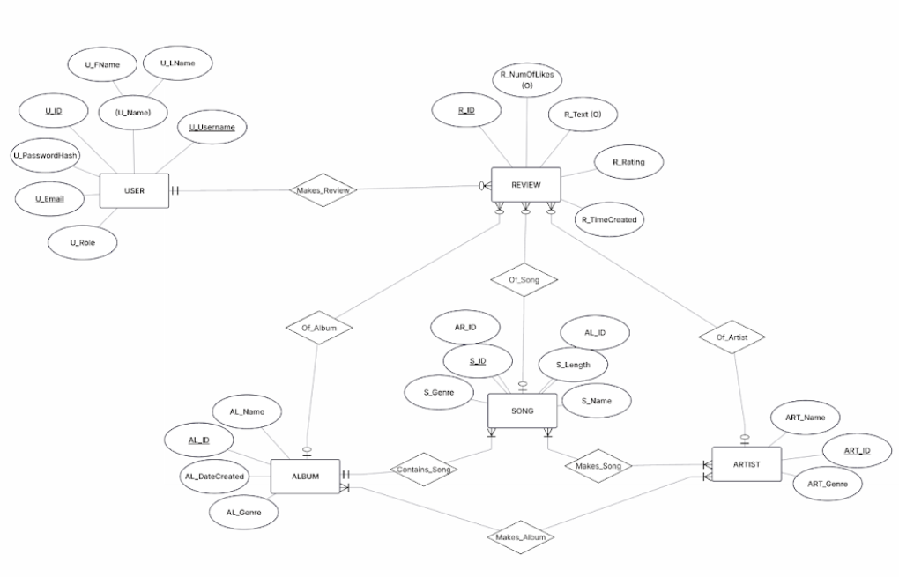
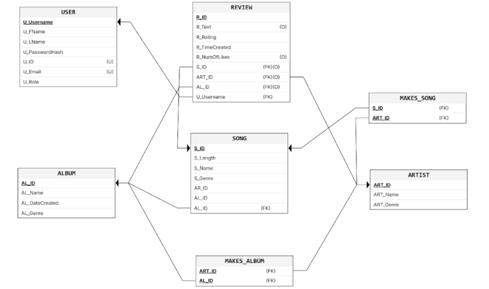
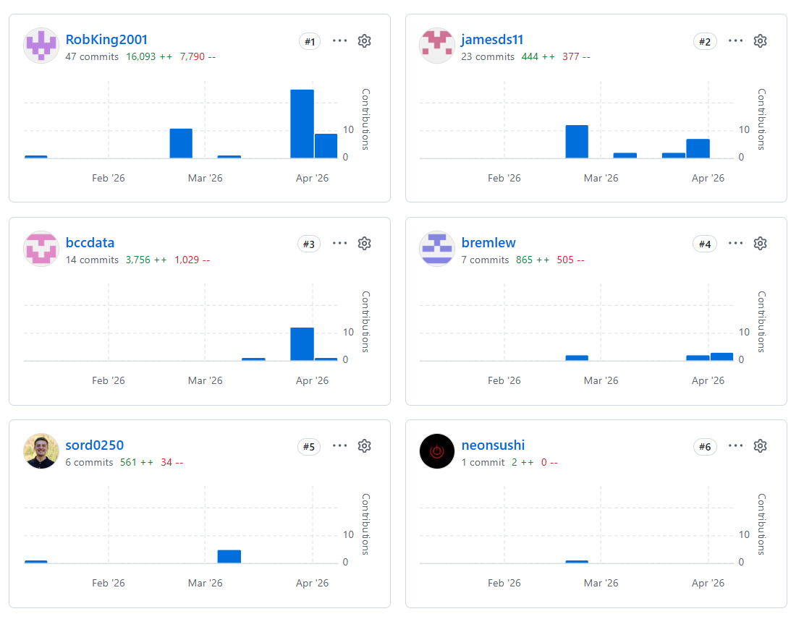
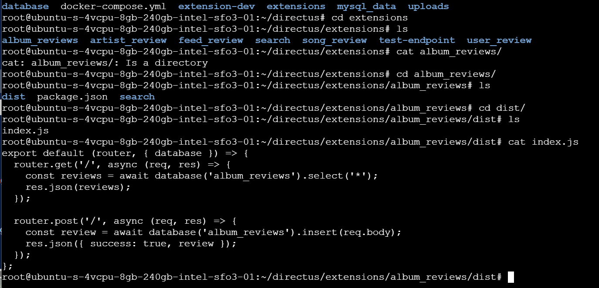
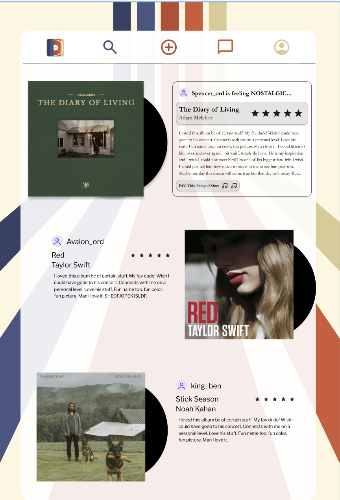

# JUKEBOXD: MUSIC REVIEWS

## IT&C 350 DATABASE DESIGN PROJECT
### WINTER 2026

* Spencer Ord
* Robert Stone
* James Sturdevant
* Ben Davis
* Brendan Lewis

---

## TABLE OF CONTENTS

* [PROJECT OBJECTIVE](#project-overview)
  * [PROJECT OBJECTIVE STATEMENT](#project-objective-statement)
  * [PROJECT STAKEHOLDERS](#project-stakeholders)
* [APP REQUIREMENTS](#app-requirements)
  * [FUNCTIONAL REQUIREMENTS](#functional-requirements)
  * [NON-FUNCTIONAL REQUIREMENTS](#non-functional-requirements)
* [DATABASE REQUIREMENTS](#database-requirements)
  * [ER DIAGRAM IMAGES](#er-diagram-images)
  * [SCHEMA DIAGRAM](#schema-diagram)
* [BUSINESS RULES](#business-rules)
  * [FIELD RULES](#field-rules)
  * [RELATIONAL RULES](#relational-rules)
  * [ROLE RULES](#role-rules)
  * [APPLICATION RULES](#application-rules)
* [DATABASE DOCUMENTATION](#database-documentation)
  * [GITHUB DOCUMENTATION](#github-documentation)
  * [NECESSARY DEPENDENCIES](#necessary-dependencies)
  * [CREATING THE DATABASE](#creating-the-database)
* [DATABASE VIEW DOCUMENTATION](#database-view-documentation)
* [API DOCUMENTATION](#api-documentation)
* [FRONT-END DOCUMENTATION](#front-end-documentation)
  * [/BACKEND`](#backend)
  * [/TEMPLATES`](#templates)
  * [/STATIC/CSS`](#static-css)
  * [/STATIC/JS`](#static-js)
* [APPENDIX 1](#appendix-1-low-fidelity-paper-prototypes)
* [APPENDIX 2](#appendix-2-sql-scripts)
  * [CREATE STATEMENTS](#create-tables)
  * [INSERT STATEMENTS](#insert-statements)
  * [DELETE STATEMENTS](#delete-statements)
  * [DELETE EVERYTHING](#delete-everything)
* [APPENDIX 3](#appendix-3-sql-views)
  * [SEARCH VIEW](#search-view)
  * [ALBUM REVIEW VIEW](#album-review-view)
  * [ARTIST REVIEW VIEW](#artist-review-view)
  * [ALBUM REVIEW VIEW](#album-review-view)
  * [USER REVIEW VIEW](#user-review-view)


---

## PROJECT OVERVIEW

### PROJECT OBJECTIVE STATEMENT
Jukeboxd is a database that stores a user's reviews of musical albums and songs. Users will also be able to see other users' reviews.

### PROJECT STAKEHOLDERS
Stakeholders in Jukeboxd include music listeners and lovers, a professional team of coders, security professionals versed in database security, a marketing team, and a management team. Other stakeholders will eventually include singers, song-writers, record labels, and other musicians or staff working in the music industry. These are the primary stakeholders that would be affected by a music rating and sharing system like Jukeboxd. 

The following contains a breakdown of our stakeholders:
* Users
  * Serious music listeners
    * This group of people really cares about music. They may have a musical background or just really enjoy listening to it. 
    * They will most likely want to share thoughtful reviews with technical breakdown and their ratings will be thought-out. 
    * They will be interested in seeing similar reviews that they will engage with academically. 
    * This will probably represent the most engaged user base, but not make up the largest portion.
  * Casual music listeners
    * This group enjoys listening to music, but does not necessarily have a deep musical background. 
    * They will leave ratings, but probably only write short reviews, many of which will be humorous rather than critical. 
    * This group of people will probably make up the majority of the user base, but not be as engaged as serious listeners.
* Employees
  * A Professional Team of coders
    * There will need to be a development team that maintains the front-end and back-end of the application. 
    * They will be invested based on their employment.
  * Security professionals versed in database security
    * There will need to be a team that ensures the database is protected from attacks.
  * A marketing team
    * This team will promote the application and try to acquire sponsorships from artists, record labels, and music-sharing apps (like Spotify, Apple Music, etc.)
  * A management team
    * The management team will oversee the entire process. They will interface with the other shareholders to ensure their views are represented in the product.
* Potential Investors/Champions 
  * Singers
    * They will want to see their songs promoted on Jukeboxd. 
    * They can take feedback based on reviews, which could help them produce more popular songs.
  * Song-writers
    * Same as singers
  * Record labels
    * They will want to see artists signed to their label receiving good reviews. 
    * They could also promote their artists through the app which could generate more listenership and therefore more revenue. 
    * They could also identify artists they would like to sign based on who receives good reviews.
  * Others working in the music industry
    * Executives in the music industry would all benefit from more people listening to music and talking about popular albums and artists. 
    * If Jukeboxd is successful, it will generate more publicity and engagement with new songs and albums which will benefit everyone in the music industry, especially executives.

## APP REQUIREMENTS

### FUNCTIONAL REQUIREMENTS
* Users can look up and review songs and albums through a search bar
* Users can see the reviews other people have made and comment on them in a feed by searching
* Users can add friends by clicking on their profile that is displayed in their reviews
* Users will have a feed page that recommends their friend's reviews
* Users will be able to upload playlists for friends to see on their own page
* Users will be able to visit the page of other users to add them as friends, read their reviews, and see their playlists

### NON-FUNCTIONAL REQUIREMENTS
* The app should work on Android and iOS
* The UI should be clean and intuitive
* The database must support at least 1,000 concurrent users
* The database and app should be secure against basic attacks and vulnerabilities
* The app and database should be available 24/7
* Offline viewing should be available for selected albums, songs, or genres
* The database should be easy to scale, maintain and update
* The reviews should be out of 5 stars and have optional text
* Leaderboards for top rated songs and albums should be available for viewing

---

## DATABASE REQUIREMENTS

### ER DIAGRAM IMAGES
Jukeboxd Entity Relationship Diagram



---

## SCHEMA DIAGRAM
Jukeboxd Relational Schema Diagram



---

## BUSINESS RULES

### FIELD RULES
* Usernames must be at least 5 characters long and no longer than 12 characters
* The text field of a review cannot exceed 300 characters in length
* A review must have a star input (out of 5 stars, including 0)
* No duplicate usernames
* No duplicate emails

### RELATIONAL RULES
* An album must have at least 1 song
* An album must have at least 1 artist
* An artist must have at least 1 album
* An artist must have at least 1 song
* A review must have at least 1 album, artist, or song
* A review must have a star input (out of 5 stars, including 0)

### ROLE RULES
* Users cannot modify other users
* Users can make reviews
* Users can "like" any other user's reviews
* Users can edit their own reviews
* Users can delete their own reviews
* Users can delete their own account
* Admin users can delete other users
* Admin users can delete songs
* Admin users can delete reviews
* Admin users can delete artists
* Admin users can delete albums
* Admin users can create new genres
* Admin users can modify descriptive tags

### APPLICATION RULES
* Passwords cannot be a single dictionary word (putting password rules here because we do not store plaintext passwords in the database, so any logic will be in the application)
* Password must be 8 characters long and no longer than 16
* Password must contain a combination of Upper and Lowercase letters
* Password must have at least 1 non-alphabetical character
* Each review must have a timestamp

---

## DATABASE DOCUMENTATION

### GITHUB DOCUMENTATION
Jukeboxd is a public GitHub. To access the scripts that we have used to create our database, click [this link](https://github.com/sord0250/Jukeboxd-ITC350) and go to the 'Milestone 3' folder found under the 'Jukeboxd' folder. You will find the following scripts that contain SQL queries that configure the database, fill it with "dummy data," and empty the tables:

* 'Create Tables'
* 'DeleteAll'
* 'DeleteSome'
* 'Insert'

The scripts are also listed in Appendix 3 of this document.

As you can see in the screenshot below, each of the 5 team members can contribute to this repository.


### NECESSARY DEPENDENCIES
* **GITHUB** - our scripts and code live on the GitHub repository mentioned above.
* **VSCODE** - although not necessary, we use VSCode to connect to our repository. This allows us to edit scripts and work together on the project. If you don’t know how to clone the repository, follow [these instructions](https://code.visualstudio.com/docs/sourcecontrol/repos-remotes). 
* **MySQL Server** - allows for a locally hosted MySQL database to be created.
* **MySQL Workbench** - connects to the server and provides a graphical user interface (GUI) to run the queries that build the tables and populate them with dummy data. This application also allows users to see tables and their data.

### CREATING THE DATABASE
Listed below are the steps to create a locally hosted MySQL database instance of Jukeboxd. These instructions include setting up the MySQL Server and executing the queries.

1) Install [MySQL Server](https://dev.mysql.com/downloads/mysql/) and [MySQL Workbench](https://dev.mysql.com/downloads/workbench/) using default settings. Click on the hyperlinks to ensure you download the correct versions (you will want the most up-to-date version of both).
   a) Set a default password for the MySQL Server that you will remember.
2) In MySQL Workbench:
   a) Connect to local database instance (Local instance MySQL 96)
   b) Run the scripts found on our GitHub (by pasting the file contents and selecting the lightning button) in the following order:
      i) [CreateTables](https://github.com/sord0250/Jukeboxd-ITC350/blob/main/jukeboxd/Milestone%203/CreateTables) - this creates the database and the necessary tables
      ii) [Insert](https://github.com/sord0250/Jukeboxd-ITC350/blob/main/jukeboxd/Milestone%203/Insert) - this inserts dummy data into the tables
      iii) [DeleteSome](https://github.com/sord0250/Jukeboxd-ITC350/blob/main/jukeboxd/Milestone%203/DeleteSome) - this gives specific examples of how to delete dummy data from the tables. This represents the kind of queries that could be sent to the database by the frontend to delete specific reviews, songs, etc..
      iv) [DeleteAll](https://github.com/sord0250/Jukeboxd-ITC350/blob/main/jukeboxd/Milestone%203/DeleteAll) - this deletes all data from tables (note: this script uses 'ALTER TABLE <table_name> AUTO_INCREMENT = 1' so that dummy data can be inserted again after deletion).

To view the database structure at any time, go to the left-hand column. Switch from administration to schemas, and click the refresh button. The database and tables will be shown in that column.

---

## DATABASE VIEW DOCUMENTATION
We created six unique views for our database. Listed below are the unique views along with the purpose they serve.

* [**Search View**](https://github.com/sord0250/Jukeboxd-ITC350/blob/main/jukeboxd/Milestone%204/Search%20Review%20View) - combines the songs, albums, and artists into one view that will be used to implement the search bar functionality
  * i.e. a user will be able to click on the search bar and search for any song, album, or artist.

* [**Album Review View**](https://github.com/sord0250/Jukeboxd-ITC350/blob/main/jukeboxd/Milestone%204/Album%20Review%20View) - combines the album information and any reviews of albums, allowing a list of reviews of albums when a user selects an album.
  * i.e. a user will be able to select an album and see a list of all reviews of that particular album.

* [**Song Review View**](https://github.com/sord0250/Jukeboxd-ITC350/blob/main/jukeboxd/Milestone%204/Song%20Review%20View) - combines song information and reviews of any songs, along with artist name and album name, allowing for a list of song information and song reviews when a song is selected.
  * i.e. a user will be able to select a song and see its artist, the album it is in, and a list of all the reviews of that particular song.

* [**Artist Review View**](https://github.com/sord0250/Jukeboxd-ITC350/blob/main/jukeboxd/Milestone%204/Artist%20Review%20View) - combines artist information with reviews of said artists, which will be used to list reviews of any artists when a user selects an artist.
  * i.e. a user will be able to select a particular artist and see a list of all reviews of that artist.

* [**User’s Reviews**](https://github.com/sord0250/Jukeboxd-ITC350/blob/main/jukeboxd/Milestone%204/Users%20Reviews%20View) - combines user information with review information which will be used so a user can see a history of their reviews.
  * i.e. a user will be able to select their own profile or another user’s profile and see a list of all their reviews, regardless of review type.


To see the queries that are run to create the views, click on the hyperlinks above to access the Github or select [this link](https://github.com/sord0250/Jukeboxd-ITC350) and navigate to the milestone 4 folder. They are also stored in Appendix 4 of this document.

## API DOCUMENTATION

Our database is being hosted on a Digital Ocean Droplet that our entire team had access to. To make our database available online, we downloaded Directus, a headless content management system. This CMS automatically wraps our database and generates a RESTful API, so we didn't need to create the REST API ourselves. This led to other issues, but we were able to successfully overcome all of them and create a working API for our jukeboxd database. 

### DIRECTUS ROUTES 

#### /items/ARTIST

#### /items/ALBUM

#### /items/USER

#### /items/SONG

#### /items/REVIEW

#### /search?q=

#### /artist_review/

#### /album_reviews/

#### /song_review/

#### /user_review/


### DIRECTUS PROBLEMS

One issue we had with Directus was creating our views. Since Directus created the API for use, we could not configure it to connect to our database views, or even see them. It took some work, but for each view that we wanted in our database, we needed to create a `.js` extension file that did ended up doing the same thing as creating a view, but with a lot more steps.  



Here is an example of a Directus view extension. 


## FRONT-END DOCUMENTATION

Our web application is incredibly complex and runs many files to properly. Below are detailed descriptions of each file necessary for our frontend.

### `jukeboxd/FrontEnd` (parent directory)

- `jukeboxd/FrontEnd/app.py`  
  Our frontend is running through a python flask container. `app.py` creates the core functionality of our frontend. It establishes the API routes for the rest of the functions. This file serves as the bridge between the database and the python files we created for the rest of the frontend to work. The only dependency we used for this file was `python.flask`. This file pulls the global variables used throughout the program from `config.py`. The only function this file uses is `{"client_config": {"DIRECTUS_URL": DIRECTUS_URL}}`, which injects the DIRECTUS_URL into all `.py` functions used in the program. 

### /BACKEND

#### `jukeboxd/FrontEnd/backend`

- `jukeboxd/FrontEnd/backend/config.py`  
  This file pulls all secret values and environment variables from `.env`. It also defines the Directus base URL, and stores size limits for `input_sanitization.py`. This file is dependent on `os` to load the `.env` variables, and `pathlib.Path` to resolve the file paths used in the web program. This file creates no UI or session state, but it does set environmental state based on information in the `.env` file.

#### `jukeboxd/FrontEnd/backend/routes`

- `jukeboxd/FrontEnd/backend/routes/pages.py`  
  This file is used to generate the HTML pages for the frontend. These URL endpoints are all accessable to a typical user: `/`, `/search`, `/profile`, `/profile/<username>`, `/add`, `/login`, `/register`, and `/stats`. This file is dependent on `python.flask` and `backend.helpers.input_sanitization`. This page is statless as its purpose is to render the pages. This file uses the `render_template()` function to render the pages, and `profile_by_username()` to generate a specialized user profile page for each user. 

- `jukeboxd/FrontEnd/backend/routes/auth.py`  
  This file creates the login, registration, and logout functions and establishes their connection with the server. It creates a connection with the Directus API, and sets session state `session["user_id"]` and `session["username"]` with the `login` function. It clears the session state in the `logout` function. The register `function` updates the database with a new user. This file has dependencies on `datetime`, `bcrypt`, `requests`, and `flask`. 

  - `/logout`

    This endpoint clears the current user's session data and redirects them to the root URL. It uses a GET method to call `session.clear()`. The user is automatically logged out because their user_id and username that are being stored in the Flask session are deleted. This doesn't interact with Directus at all. 

  - `/api/register`   

    This endpoint uses a POST method to register a new user in the database. This endpoint uses the parameters firstName, lastName, username, email, and password to create the new user. This route first sends the input parameters through `input_sanitization.py`. If an input does not pass an `input_sanitization.py`, it is set as NULL, and the user is prompted to insert a valid input instead. Then, all passwords are hashed with `bcrypt.hashpw`. Then, a POST is sent to the Directus endpoint `/items/USER` with the user's information. 

  - `/api/login`

    This endpoint checks if a user exists in the database. It also sends the user inputs to `input_sanitization.py`, and subsequently passes the password through a hash function before sending them to `/items/USER` in Directus with a GET request. If the password hash doesn't match with the one stored in the database, the login fails, and if the username does not exist in the database, then the login also fails. If the passwords match, then `session["user_id"]` and `session["username"]` are set from the U_ID and U_Username pulled from the database. 

- `jukeboxd/FrontEnd/backend/routes/data.py`  
  This file connects to the Directus API endpoints, and sets a route for the rest of the application to connect to the basic Directus endpoints. This file has dependencies on `python.requests` and `jsonify`. This file is stateless and creates a function for each API endpoint. For example, `get_users()` retrieves the Directus endpoint `/items/USER` for use by the frontend. 

- `jukeboxd/FrontEnd/backend/routes/profile.py`  
  This file creates the backend logic for the user profile page. This file uses both GET and PATCH methods to pull from and update the database. This file checks for session state set with `user_id` and `username`. If there is no path set, and if there is a set This file is dependent on `python.flask` and `python.requests`. 

- `jukeboxd/FrontEnd/backend/routes/reviews.py`  
  Largest route module. It powers the review feed, related review search, likes, comments, user review lists, and review creation.

- `jukeboxd/FrontEnd/backend/routes/friendships.py`  
  Friendship API routes for loading friendship state, sending requests, accepting requests, canceling or declining requests, and removing friends.

#### `jukeboxd/FrontEnd/backend/helpers`

- `jukeboxd/FrontEnd/backend/helpers/__init__.py`  
  Package marker for backend helper modules.

- `jukeboxd/FrontEnd/backend/helpers/common.py`  
  Shared backend utilities for extracting Directus payloads, filtering user reviews, normalizing item types, coercing like counts, and surfacing API error messages.

- `jukeboxd/FrontEnd/backend/helpers/comments.py`  
  Comment helper layer that loads comment rows from Directus, normalizes them, builds preview lists, and posts new comments.

- `jukeboxd/FrontEnd/backend/helpers/friendships.py`  
  Friendship-specific helper layer for reading friendship rows, normalizing friend data, ordering friendship pairs, and looking up users in friendships.

- `jukeboxd/FrontEnd/backend/helpers/input_sanitization.py`  
  Server-side sanitization and validation for names, usernames, emails, passwords, comments, reviews, ratings, and review payload construction.

- `jukeboxd/FrontEnd/backend/helpers/payloads.py`  
  Convenience wrapper functions for fetching the Directus payload bundles needed by feed, search, and profile review normalization.

- `jukeboxd/FrontEnd/backend/helpers/profile.py`  
  Profile helper functions for looking users up by username, serializing user objects, and translating Directus profile-update errors into friendlier messages.

- `jukeboxd/FrontEnd/backend/helpers/review_normalization.py`  
  Data-shaping layer that merges raw Directus review data with song, album, artist, and relationship tables so the frontend gets consistent feed/search/profile review objects.

### /TEMPLATES

#### `jukeboxd/FrontEnd/templates`

- `jukeboxd/FrontEnd/templates/index.html`  
  Home feed page. It renders the welcome section, feed filter buttons, feed list, and back-to-top button.

- `jukeboxd/FrontEnd/templates/search.html`  
  Search page. It renders the live search UI and the modal that shows top related reviews for a selected item.

- `jukeboxd/FrontEnd/templates/add.html`  
  Add-review page. It contains the search picker, star rating controls, review text area, form message, and review toast.

- `jukeboxd/FrontEnd/templates/login.html`  
  Login form page for email and password sign-in.

- `jukeboxd/FrontEnd/templates/register.html`  
  Registration form page for first name, last name, username, email, and password.

- `jukeboxd/FrontEnd/templates/profile.html`  
  Profile page layout. It shows profile summary info, friends, incoming requests, account actions, and the user’s review list.

- `jukeboxd/FrontEnd/templates/stats.html`  
  Placeholder page for future stats or messages work. Right now it only renders a very minimal page shell.

#### `jukeboxd/FrontEnd/templates/components`

- `jukeboxd/FrontEnd/templates/components/navbar.html`  
  Shared top navigation bar used across the site, including the home logo, search/add links, and profile/account area.

- `jukeboxd/FrontEnd/templates/components/scripts.html`  
  Shared script include file that loads the app’s core JavaScript modules in order.

- `jukeboxd/FrontEnd/templates/components/profile_edit_modal.html`  
  Partial template for the edit-profile modal, including locked username/email fields and editable first/last name fields.

- `jukeboxd/FrontEnd/templates/components/profile_friends_modal.html`  
  Partial template for the popout friends-list modal on the profile page.

### /STATIC/CSS

#### `jukeboxd/FrontEnd/static/css`

- `jukeboxd/FrontEnd/static/css/base.css`  
  Main stylesheet for the app. It contains the global layout, navbar, feed cards, search UI, add-review form, profile layout, modals, and responsive styling.

- `jukeboxd/FrontEnd/static/css/profile-friendships.css`  
  Focused stylesheet for friendship and friends-list UI on the profile page.

- `jukeboxd/FrontEnd/static/css/components.css`  
  Currently empty placeholder stylesheet. It appears to have been reserved for shared component styles but is not active right now.

- `jukeboxd/FrontEnd/static/css/layout.css`  
  Currently empty placeholder stylesheet. It appears to have been reserved for layout-specific styles but is not active right now.


### /STATIC/JS

#### `jukeboxd/FrontEnd/static/js/app`

- `jukeboxd/FrontEnd/static/js/app/boot.js`  
  App bootstrapper. It calls all page initialization functions after `DOMContentLoaded`.

- `jukeboxd/FrontEnd/static/js/app/core.js`  
  Small shared utility layer for checking login state, reading/writing localStorage identity, and logging out.

- `jukeboxd/FrontEnd/static/js/app/api.js`  
  Shared frontend API wrapper for search, feed, reviews, comments, profiles, friendships, and likes.

- `jukeboxd/FrontEnd/static/js/app/navbar.js`  
  Navbar behavior module. It fills the account dropdown with login/register or logout actions depending on local login state.

- `jukeboxd/FrontEnd/static/js/app/reviews.js`  
  Shared review UI engine. It normalizes review objects, builds feed cards, supports likes, opens the comment modal, formats ratings, and generates profile links from usernames.

#### `jukeboxd/FrontEnd/static/js/app/pages`

- `jukeboxd/FrontEnd/static/js/app/pages/auth.js`  
  Login and registration page logic, including form validation, API calls, and localStorage session setup after login.

- `jukeboxd/FrontEnd/static/js/app/pages/feed.js`  
  Home feed page controller. It loads the feed, handles infinite scrolling, supports the all/friends/song/album/artist filters, and renders empty-state messages.

- `jukeboxd/FrontEnd/static/js/app/pages/search.js`  
  Search page controller. It performs live search queries, opens the detail modal, and loads the top related reviews for the selected item.

- `jukeboxd/FrontEnd/static/js/app/pages/add.js`  
  Add-review page controller. It handles search selection, star ratings, character counts, and posting new reviews.

- `jukeboxd/FrontEnd/static/js/app/pages/profile.js`  
  Main profile page controller. It loads profile data and review history, wires in like/comment behavior, and manages the edit-profile modal.

- `jukeboxd/FrontEnd/static/js/app/pages/profile_friendships.js`  
  Friendship-specific profile controller. It renders friends, requests, connection states, the friends modal, and the friend-action buttons.


## APPENDIX 1: LOW-FIDELITY PAPER PROTOTYPES



## APPENDIX 2: SQL SCRIPTS

### CREATE TABLES

```sql
CREATE DATABASE Jukeboxd;
USE Jukeboxd;
```

```sql
CREATE TABLE USER
(
  U_FName VARCHAR(50) NOT NULL,
  U_LName VARCHAR(50) NOT NULL,
  U_Username VARCHAR(12) NOT NULL,
  CHECK (character_length(U_Username) > 4),
  U_PasswordHash TEXT NOT NULL,
  U_ID INT AUTO_INCREMENT NOT NULL,
  U_Email VARCHAR(50) NOT NULL,
  U_Role VARCHAR(50) NOT NULL,
  PRIMARY KEY (U_ID),
  UNIQUE (U_Username),
  UNIQUE (U_Email)
);
```

```sql
CREATE TABLE ALBUM
(
  AL_Name VARCHAR(100) NOT NULL,
  AL_ID INT AUTO_INCREMENT NOT NULL,
  AL_DateCreated DATE NOT NULL,
  AL_Genre VARCHAR(50) NOT NULL,
  PRIMARY KEY (AL_ID)
);
```

```sql
CREATE TABLE ARTIST
(
  ART_ID INT AUTO_INCREMENT NOT NULL,
  ART_Name VARCHAR(50) NOT NULL,
  ART_Genre VARCHAR(50) NOT NULL,
  PRIMARY KEY (ART_ID)
);
```

```sql
CREATE TABLE SONG
(
  S_ID INT AUTO_INCREMENT NOT NULL,
  S_Length INT NOT NULL,
  S_Name VARCHAR(100) NOT NULL,
  S_Genre VARCHAR(50) NOT NULL,
  ART_ID INT NOT NULL,
  AL_ID INT NOT NULL,
  PRIMARY KEY (S_ID),
  FOREIGN KEY (AL_ID) REFERENCES ALBUM(AL_ID),
  FOREIGN KEY (ART_ID) REFERENCES ARTIST(ART_ID)
);
```

```sql
CREATE TABLE REVIEW
(
  R_ID INT AUTO_INCREMENT NOT NULL,
  R_Text VARCHAR(300),
  R_Rating FLOAT NOT NULL,
  CHECK (R_Rating <= 5 AND R_Rating >= 0),
  R_TimeCreated DATETIME NOT NULL,
  R_NumOfLikes INT,
  S_ID INT,
  ART_ID INT,
  AL_ID INT,
  U_Username VARCHAR(12) NOT NULL,
  PRIMARY KEY (R_ID),
  FOREIGN KEY (S_ID) REFERENCES SONG(S_ID),
  FOREIGN KEY (ART_ID) REFERENCES ARTIST(ART_ID),
  FOREIGN KEY (AL_ID) REFERENCES ALBUM(AL_ID),
  FOREIGN KEY (U_Username) REFERENCES USER(U_Username)
);
```

```sql
CREATE TABLE MAKES_SONG
(
  S_ID INT NOT NULL,
  ART_ID INT NOT NULL,
  PRIMARY KEY (S_ID, ART_ID),
  FOREIGN KEY (S_ID) REFERENCES SONG(S_ID),
  FOREIGN KEY (ART_ID) REFERENCES ARTIST(ART_ID)
);
```

```sql
CREATE TABLE MAKES_ALBUM
(
  ART_ID INT NOT NULL,
  AL_ID INT NOT NULL,
  PRIMARY KEY (ART_ID, AL_ID),
  FOREIGN KEY (ART_ID) REFERENCES ARTIST(ART_ID),
  FOREIGN KEY (AL_ID) REFERENCES ALBUM(AL_ID)
);
```

### INSERT STATEMENTS

```sql
INSERT INTO USER (U_Username, U_FName, U_LName, U_PasswordHash, U_Email, U_Role) VALUES 
('AliceWonder', 'Alice', 'Smith', SHA2('pass123', 256), 'alice@example.com', 'User'),
('MelodyMaker', 'Charlie', 'Brown', SHA2('rockon', 256), 'charlie@example.com', 'User'),
('VinylVibes', 'Dana', 'White', SHA2('records4life', 256), 'dana@example.com', 'User'),
('BassBoost', 'Eddie', 'Gomez', SHA2('lowend', 256), 'eddie@example.com', 'User'),
('SynthWave', 'Fiona', 'Gallagher', SHA2('80svibe', 256), 'fiona@example.com', 'User'),
('JazzCat', 'George', 'Miller', SHA2('smoothjazz', 256), 'george@example.com', 'User'),
('MetalHead', 'Hank', 'Hill', SHA2('heavystuff', 256), 'hank@example.com', 'User'),
('PopPrincess', 'Ivy', 'Blue', SHA2('top40', 256), 'ivy@example.com', 'User'),
('LoFiLover', 'Jack', 'Black', SHA2('chillbeats', 256), 'jack@example.com', 'User');
```

```sql
INSERT INTO ARTIST (ART_Name, ART_Genre) VALUES 
('The Electric Ants', 'Indie Rock'),
('Midnight City', 'Synthpop'),
('Lunar Echo', 'Ambient'),
('Iron Strings', 'Metal'),
('Velvet Voice', 'Jazz'),
('Neon Dreams', 'Electronic'),
('The Acoustic Trio', 'Folk'),
('Durban Beats', 'Afrobeats'),
('Cloud Nine', 'Lo-Fi'),
('Rhythm Kings', 'Funk');
```

```sql
INSERT INTO ALBUM (AL_Name, AL_DateCreated, AL_Genre) VALUES 
('Static Skies', '2019-05-12', 'Indie Rock'),
('Midnight Run', '2020-11-01', 'Synthpop'),
('Void', '2021-02-14', 'Ambient'),
('Rusty Gears', '2017-08-30', 'Metal'),
('Blue Notes', '2022-01-05', 'Jazz'),
('Digital Pulse', '2023-06-15', 'Electronic'),
('Campfire Songs', '2016-10-10', 'Folk'),
('Sunlight', '2022-09-22', 'Afrobeats'),
('Sleepy Head', '2021-12-01', 'Lo-Fi'),
('Groove Nation', '2018-04-04', 'Funk');
INSERT INTO MAKES_ALBUM (ART_ID, AL_ID) VALUES 
(1, 1), (2, 2), (3, 3), (4, 4), (5, 5), (6, 6), (7, 7), (8, 8), (9, 9), (10, 10);
```

```sql
INSERT INTO SONG (S_Length, S_Name, S_Genre, ART_ID, AL_ID) VALUES 
('210', 'Electric Dreams', 'Indie Rock', 2, 2),
('195', 'Low Light', 'Indie Rock', 2, 2),
('240', 'Synth City', 'Synthpop', 3, 3),
('205', 'After Hours', 'Synthpop', 3, 3),
('420', 'Event Horizon', 'Ambient', 4, 4),
('380', 'Stardust', 'Ambient', 4, 4),
('215', 'Heavy Metal Thunder', 'Metal', 5, 5),
('233', 'Grinding Gears', 'Metal', 5, 5),
('285', 'Autumn Leaves', 'Jazz', 6, 6),
('310', 'Coffee Shop Blues', 'Jazz', 6, 6),
('190', 'Glitch in the Matrix', 'Electronic', 7, 7),
('200', 'Pulse Rate', 'Electronic', 7, 7),
('185', 'Mountain Air', 'Folk', 8, 8),
('220', 'River Flow', 'Folk', 8, 8),
('245', 'Lagos Night', 'Afrobeats', 9, 9),
('212', 'Island Sun', 'Afrobeats', 9, 9),
('145', 'Lo-Fi Chill', 'Lo-Fi', 10, 10),
('160', 'Study Session', 'Lo-Fi', 10, 10),
('275', 'Get Up and Dance', 'Funk', 1, 1),
('290', 'The Funky Penguin', 'Funk', 1, 1);
```

```sql
INSERT INTO MAKES_SONG (ART_ID, S_ID) VALUES 
(2, 1), (2, 2), (3, 3), (3, 4), (4, 5), (4, 6), (5, 7), (5, 8), (6, 9), (6, 10), (7, 11), (7, 12), (8, 13), (8, 14), (9, 15), (9, 16), (10, 17), (10, 18), (1, 19), (1, 20); 
```

```sql
INSERT INTO REVIEW (R_Text, R_Rating, R_TimeCreated, R_NumOfLikes, S_ID, ART_ID, AL_ID, U_Username) VALUES 
('Incredible production quality.', 5, '2024-05-21 10:00:00', 5, 2, 1, 1, 'AliceWonder'),
('A bit too slow for me.', 2, '2024-05-22 08:15:00', 1, 3, 2, 2, 'MelodyMaker'),
('This album changed my life.', 5, '2024-05-23 12:00:00', 12, 3, 3, 3, 'VinylVibes'),
('The guitar solo is insane!', 4, '2024-05-24 16:45:00', 3, 4, 1, 1, 'BassBoost'),
('Perfect for studying.', 5, '2024-05-25 22:30:00', 8, 9, 3, 3, 'SynthWave'),
('Not their best work.', 3, '2024-05-26 09:10:00', 0, 1, 5, 3, 'JazzCat'),
('Heavy and melodic.', 4, '2024-05-27 11:00:00', 4, 4, 1, 3, 'MetalHead'),
('Catchy but repetitive.', 3, '2024-05-28 14:20:00', 2, 6, 1, 3, 'PopPrincess'),
('Total vibe.', 5, '2024-05-29 19:00:00', 10, 10, 3, 3, 'LoFiLover');
```

### DELETE STATEMENTS

```sql
-- Deleting 'AliceWonder'
DELETE FROM REVIEW WHERE U_Username = 'AliceWonder';
DELETE FROM USER WHERE U_Username = 'AliceWonder';
```

```sql
-- Deleting 'MetalHead'
DELETE FROM REVIEW WHERE U_Username = 'MetalHead';
DELETE FROM USER WHERE U_Username = 'MetalHead';
```

```sql
-- Deleting 'Neon Lights' (S_ID = 3)
DELETE FROM MAKES_SONG WHERE S_ID = 3;
DELETE FROM REVIEW WHERE S_ID = 3;
DELETE FROM SONG WHERE S_ID = 3;
```

```sql
-- Deleting 'Anthem' (S_ID = 2)
DELETE FROM MAKES_SONG WHERE S_ID = 2;
DELETE FROM REVIEW WHERE S_ID = 2;
DELETE FROM SONG WHERE S_ID = 2;
```

```sql
-- Deleting Artist 'Midnight City' (ART_ID = 3) and their Album 'Void' (AL_ID = 3)
DELETE FROM REVIEW WHERE ART_ID = 3 OR AL_ID = 3;
DELETE FROM MAKES_SONG WHERE ART_ID = 3;
DELETE FROM MAKES_ALBUM WHERE ART_ID = 3 OR AL_ID = 3;
```

```sql
-- Deleting Artist 'Lunar Echo' (ART_ID = 4) and their Album 'Rusty Gears' (AL_ID = 4)
DELETE FROM REVIEW WHERE ART_ID = 4 OR AL_ID = 4;
DELETE FROM MAKES_SONG WHERE ART_ID = 4;
DELETE FROM MAKES_ALBUM WHERE ART_ID = 4 OR AL_ID = 4;
DELETE FROM SONG WHERE AL_ID = 4;
DELETE FROM ALBUM WHERE AL_ID = 4;
DELETE FROM ARTIST WHERE ART_ID = 4;
```

### DELETE EVERYTHING

```sql
DELETE FROM REVIEW;
ALTER TABLE REVIEW AUTO_INCREMENT = 1;
DELETE FROM USER;
ALTER TABLE USER AUTO_INCREMENT = 1;
DELETE FROM MAKES_SONG;
DELETE FROM MAKES_ALBUM;
DELETE FROM SONG;
ALTER TABLE SONG AUTO_INCREMENT = 1;
DELETE FROM ALBUM;
ALTER TABLE ALBUM AUTO_INCREMENT = 1;
DELETE FROM ARTIST;
ALTER TABLE ARTIST AUTO_INCREMENT = 1;
```

## APPENDIX 3: SQL VIEWS

### SEARCH VIEW

```sql
USE jukeboxd;
CREATE OR REPLACE VIEW search AS 
SELECT 
    s.S_Name AS Song,
    s.S_Length,
    s.S_Genre AS Song_Genre,
    ar.ART_Name AS Artist,
    ar.ART_Genre AS Artist_Genre,
    al.AL_Name AS Album,
    al.AL_Genre AS Album_Genre
FROM song s
JOIN artist ar 
    ON s.ART_ID = ar.ART_ID
JOIN album al 
    ON s.AL_ID = al.AL_ID;
```

### ALBUM REVIEW VIEW
```sql
USE jukeboxd;
CREATE or REPLACE VIEW album_reviews AS
SELECT album.AL_ID AS id,
    AL_Name AS name,
    AL_Genre AS genre,
    R_ID AS review_id,
    R_Text AS review_text,
    R_Rating AS review_rating,
    R_TimeCreated AS time_created,
    R_NumOfLikes AS review_num_likes
FROM album
JOIN review
	ON album.AL_ID = review.AL_ID;
```

### SONG REVIEW VIEW
```sql
USE jukeboxd;
CREATE OR REPLACE VIEW song_review AS
SELECT 
	S_Name, 
	S_Genre, 
	R_Text, 
	R_Rating, 
	R_TimeCreated, 
	R_NumOfLikes, 
	AL_Name, 
	ART_Name
FROM jukeboxd.song
JOIN review 
	ON review.S_ID = song.S_ID
JOIN album 
	ON album.AL_ID = song.AL_ID
JOIN artist 
	ON artist.ART_ID = song.ART_ID;
```

### ARTIST REVIEW VIEW
```sql
USE jukeboxd;
CREATE or REPLACE VIEW artist_review AS
SELECT 
    a.ART_ID,
    a.ART_Name,
    a.ART_Genre,
    b.R_ID,
    b.R_Text,
    b.R_Rating,
    b.R_TimeCreated,
    b.R_NumOfLikes
FROM artist a
JOIN review b
	ON a.ART_ID = b.ART_ID;
```

### USER REVIEW VIEW
```sql
CREATE or REPLACE VIEW user_reviews AS
SELECT
	u.U_Username,
	u.U_ID,
	r.R_ID,
	r.R_Text,
	r.R_Rating,
	r.R_TimeCreated,
	r.R_NumOfLikes
FROM user u
JOIN review r
	ON u.U_Username = r.U_Username;
```


